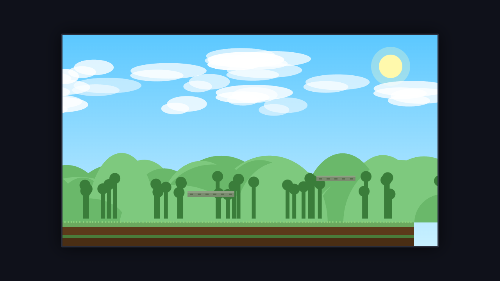
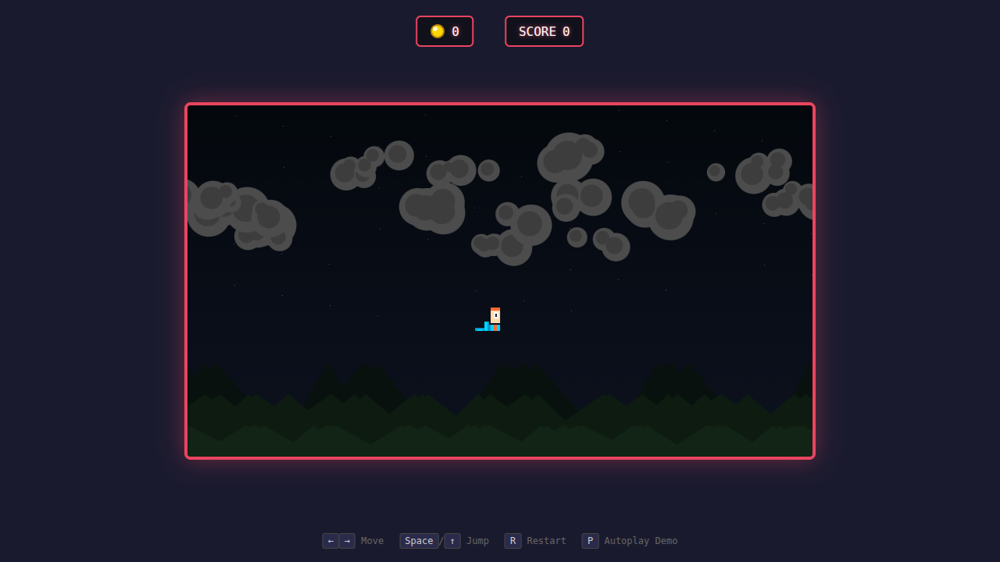

# ⚔️ Duelo: Juego de plataformas

- **Reto ID:** `platformer`
- **Categoría:** `game`
- **Fecha:** `20260919-030932`
- **Ganador:** 🏆 **or:deepseek/deepseek-v4-flash-0731:free**

---

### 📸 Capturas del Resultado:

| **A · or:deepseek/deepseek-v4-flash-0731:free** | **B · or:nvidia/nemotron-3-ultra-550b-a55b:free** |
| :---: | :---: |
| <a href="a-or_deepseek_deepseek-v4-flash-0731_free/shot_end.png"></a> | <a href="b-or_nvidia_nemotron-3-ultra-550b-a55b_free/shot_end.png"></a> |
| ⭐ **Nota:** 38/100 · ⏱️ 610.372s | ⭐ **Nota:** 32/100 · ⏱️ 245.38s |

---

### 🌐 Probar en vivo (en el navegador):
- **A · or:deepseek/deepseek-v4-flash-0731:free:** [🎮 Probar demo interactiva en vivo](https://pub-68274156337740f09cc8dc0055b40362.r2.dev/matches/20260919-030932_platformer/a/index.html)
- **B · or:nvidia/nemotron-3-ultra-550b-a55b:free:** [🎮 Probar demo interactiva en vivo](https://pub-68274156337740f09cc8dc0055b40362.r2.dev/matches/20260919-030932_platformer/b/index.html)

---

### 📝 Prompt suministrado a ambos modelos:
> Create a polished side-scrolling 2D platformer on Canvas in the style of the 16-bit classics, with an original hero (not an existing character) drawn with code as colorful pixel art. The level scrolls horizontally and is at least 6 screens long, with ground, floating platforms, gaps to jump, moving platforms, coins to collect, enemies that walk back and forth (the hero defeats them by jumping on them) and a goal flag at the end. Include parallax background layers (sky, clouds, hills), a coin counter and a score, simple particle effects when collecting coins or defeating enemies, and a win screen when the flag is reached. Controls: Arrow Left/Right to move, Space or Arrow Up to jump, R to restart. No external assets. Vanilla JS.

Also include an autoplay demo mode toggled with the P key, in which the game plays itself competently (an AI controls the player) so a viewer can watch a good run.

Requirements: deliver everything in ONE self-contained HTML file (inline CSS and JavaScript; no external resources, CDNs, fonts or images). Reply with the complete file in a single ```html code block.

---

### 📊 Resultados y Métricas:

| Modelo | Nota Juez | Tiempo | Tokens | Coste | Archivos |
| :--- | :---: | :---: | :---: | :---: | :---: |
| **A · or:deepseek/deepseek-v4-flash-0731:free** | 38 / 100 | 610.372 s | 21862 | 0.0000 $ | [Ver código](a-or_deepseek_deepseek-v4-flash-0731_free/) · [🎮 Jugar demo](https://pub-68274156337740f09cc8dc0055b40362.r2.dev/matches/20260919-030932_platformer/a/index.html) |
| **B · or:nvidia/nemotron-3-ultra-550b-a55b:free** | 32 / 100 | 245.38 s | 16770 | 0.0000 $ | [Ver código](b-or_nvidia_nemotron-3-ultra-550b-a55b_free/) · [🎮 Jugar demo](https://pub-68274156337740f09cc8dc0055b40362.r2.dev/matches/20260919-030932_platformer/b/index.html) |

---

### 🎮 Cómo probarlo en local:
Puedes abrir directamente en tu navegador cualquiera de los archivos `index.html` dentro de cada carpeta de contendiente.

*Generado automáticamente por el pipeline de [VERSUS](https://github.com/grawwww-ai/versus-lab).*
