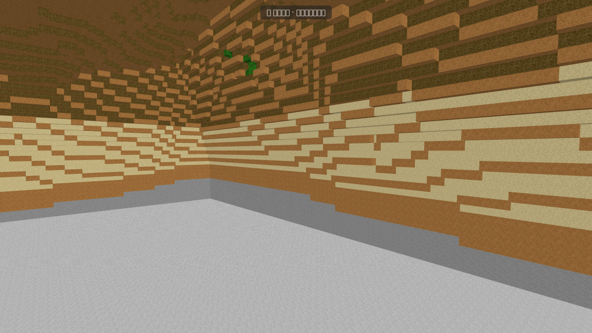

# ⚔️ Duelo: Mundo tipo Minecraft

- **Reto ID:** `voxel_world`
- **Categoría:** `3d`
- **Fecha:** `20260919-030932`
- **Ganador:** 🏆 **or:deepseek/deepseek-v4-flash-0731:free**

---

### 📸 Capturas del Resultado:

| **A · or:deepseek/deepseek-v4-flash-0731:free** | **B · or:nvidia/nemotron-3-ultra-550b-a55b:free** |
| :---: | :---: |
| <a href="a-or_deepseek_deepseek-v4-flash-0731_free/shot_end.png"></a> | <a href="b-or_nvidia_nemotron-3-ultra-550b-a55b_free/shot_end.png"></a> |
| ⭐ **Nota:** 68/100 · ⏱️ 1027.521s | ⭐ **Nota:** 5/100 · ⏱️ 173.037s |

---

### 🌐 Probar en vivo (en el navegador):
- **A · or:deepseek/deepseek-v4-flash-0731:free:** [🎮 Probar demo interactiva en vivo](https://pub-68274156337740f09cc8dc0055b40362.r2.dev/matches/20260919-030932_voxel_world/a/index.html)
- **B · or:nvidia/nemotron-3-ultra-550b-a55b:free:** [🎮 Probar demo interactiva en vivo](https://pub-68274156337740f09cc8dc0055b40362.r2.dev/matches/20260919-030932_voxel_world/b/index.html)

---

### 📝 Prompt suministrado a ambos modelos:
> Using three.js, build a Minecraft-style voxel world and show it off with a cinematic flythrough. Requirements: a procedurally generated terrain of cube blocks (at least 128x128 columns) using layered noise, with grass-topped hills, snowy mountain peaks, sandy beaches, a lake or sea with semi-transparent water, and trees made of wood and leaf blocks; blocks must have per-face shading so the cube shapes read clearly (draw the block textures procedurally on a canvas, pixel-art style); a sky with a sun, soft distance fog and fluffy block clouds that drift slowly. Use InstancedMesh or merged geometry so it runs smoothly. The camera flies automatically over and between the hills on a smooth path, looking around the landscape. Use the requestAnimationFrame timestamp for animation time. Full-window canvas that handles resizing. Starts automatically, no interaction needed.

three.js (r186) is available as an ES module: use `import * as THREE from 'three'` and addons from 'three/addons/...' (e.g. 'three/addons/controls/OrbitControls.js') inside <script type="module">. An import map is provided for you: do not add your own import map or any CDN URL.

Requirements: deliver everything in ONE self-contained HTML file (inline CSS and JavaScript; no external resources, CDNs, fonts or images). Reply with the complete file in a single ```html code block.

---

### 📊 Resultados y Métricas:

| Modelo | Nota Juez | Tiempo | Tokens | Coste | Archivos |
| :--- | :---: | :---: | :---: | :---: | :---: |
| **A · or:deepseek/deepseek-v4-flash-0731:free** | 68 / 100 | 1027.521 s | 35583 | 0.0000 $ | [Ver código](a-or_deepseek_deepseek-v4-flash-0731_free/) · [🎮 Jugar demo](https://pub-68274156337740f09cc8dc0055b40362.r2.dev/matches/20260919-030932_voxel_world/a/index.html) |
| **B · or:nvidia/nemotron-3-ultra-550b-a55b:free** | 5 / 100 | 173.037 s | 12476 | 0.0000 $ | [Ver código](b-or_nvidia_nemotron-3-ultra-550b-a55b_free/) · [🎮 Jugar demo](https://pub-68274156337740f09cc8dc0055b40362.r2.dev/matches/20260919-030932_voxel_world/b/index.html) |

---

### 🎮 Cómo probarlo en local:
Puedes abrir directamente en tu navegador cualquiera de los archivos `index.html` dentro de cada carpeta de contendiente.

*Generado automáticamente por el pipeline de [VERSUS](https://github.com/grawwww-ai/versus-lab).*
