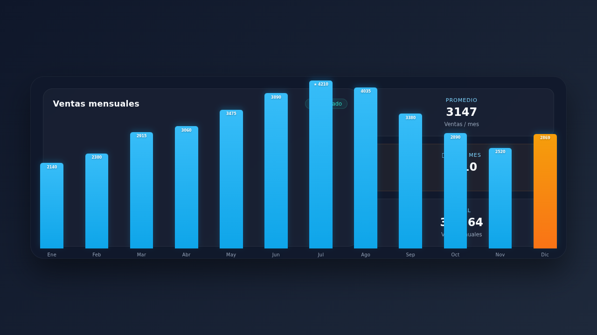
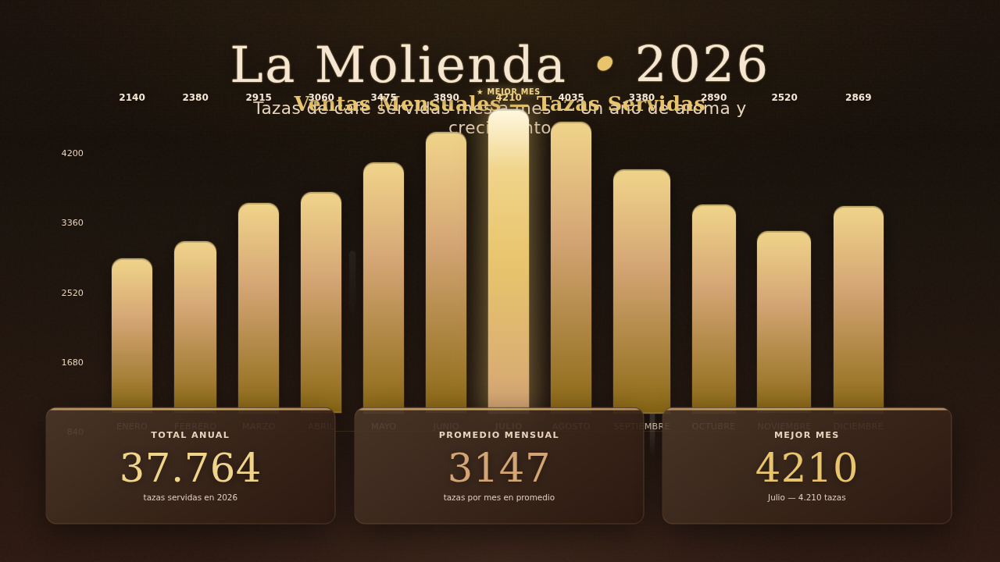

# ⚔️ Duelo: Infografía con datos

- **Reto ID:** `data_infographic`
- **Categoría:** `art`
- **Fecha:** `20260919-032204`
- **Ganador:** 🏆 **or:nvidia/nemotron-3-ultra-550b-a55b:free**

---

### 📸 Capturas del Resultado:

| **A · or:deepseek/deepseek-v4-flash-0731:free** | **B · or:nvidia/nemotron-3-ultra-550b-a55b:free** |
| :---: | :---: |
| <a href="a-or_deepseek_deepseek-v4-flash-0731_free/shot_end.png"></a> | <a href="b-or_nvidia_nemotron-3-ultra-550b-a55b_free/shot_end.png"></a> |
| ⭐ **Nota:** 62/100 · ⏱️ 1033.009s | ⭐ **Nota:** 83/100 · ⏱️ 80.95s |

---

### 🌐 Probar en vivo (en el navegador):
- **A · or:deepseek/deepseek-v4-flash-0731:free:** [🎮 Probar demo interactiva en vivo](https://pub-68274156337740f09cc8dc0055b40362.r2.dev/matches/20260919-032204_data_infographic/a/index.html)
- **B · or:nvidia/nemotron-3-ultra-550b-a55b:free:** [🎮 Probar demo interactiva en vivo](https://pub-68274156337740f09cc8dc0055b40362.r2.dev/matches/20260919-032204_data_infographic/b/index.html)

---

### 📝 Prompt suministrado a ambos modelos:
> Create a stunning animated infographic (one full screen, 16:9) about a fictional coffee shop, "La Molienda", showing the cups of coffee it sold each month in 2026. These are the exact data: Enero: 2140, Febrero: 2380, Marzo: 2915, Abril: 3060, Mayo: 3475, Junio: 3890, Julio: 4210, Agosto: 4035, Septiembre: 3380, Octubre: 2890, Noviembre: 2520, Diciembre: 2869.

Requirements: a bar chart with the 12 months in order, bars growing with an entrance animation, each bar labelled with its month and value; highlight the best month; show three big KPI figures computed from the data: the yearly TOTAL, the monthly AVERAGE and the BEST MONTH; a title and a short subtitle; a warm coffee-themed visual design with care for typography and colour. Every bar must be an HTML or SVG element with the attribute data-value set to its exact number (in month order, January first), and its height must be proportional to that value. All texts in Spanish. No external resources.

Requirements: deliver everything in ONE self-contained HTML file (inline CSS and JavaScript; no external resources, CDNs, fonts or images). Reply with the complete file in a single ```html code block.

---

### 📊 Resultados y Métricas:

| Modelo | Nota Juez | Tiempo | Tokens | Coste | Archivos |
| :--- | :---: | :---: | :---: | :---: | :---: |
| **A · or:deepseek/deepseek-v4-flash-0731:free** | 62 / 100 | 1033.009 s | 35168 | 0.0000 $ | [Ver código](a-or_deepseek_deepseek-v4-flash-0731_free/) · [🎮 Jugar demo](https://pub-68274156337740f09cc8dc0055b40362.r2.dev/matches/20260919-032204_data_infographic/a/index.html) |
| **B · or:nvidia/nemotron-3-ultra-550b-a55b:free** | 83 / 100 | 80.95 s | 6818 | 0.0000 $ | [Ver código](b-or_nvidia_nemotron-3-ultra-550b-a55b_free/) · [🎮 Jugar demo](https://pub-68274156337740f09cc8dc0055b40362.r2.dev/matches/20260919-032204_data_infographic/b/index.html) |

---

### 🎮 Cómo probarlo en local:
Puedes abrir directamente en tu navegador cualquiera de los archivos `index.html` dentro de cada carpeta de contendiente.

*Generado automáticamente por el pipeline de [VERSUS](https://github.com/grawwww-ai/versus-lab).*
