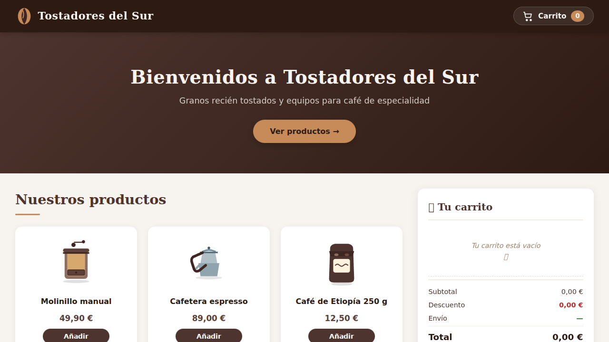
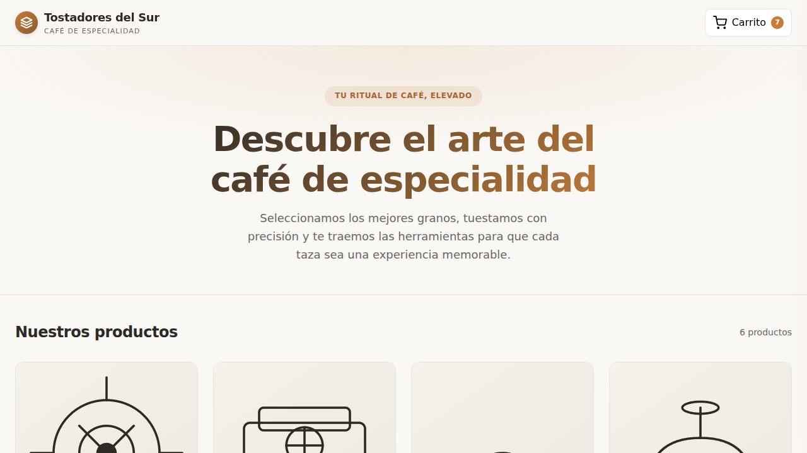

# ⚔️ Duelo: Tienda online con carrito

- **Reto ID:** `coffee_shop`
- **Categoría:** `web`
- **Fecha:** `20260919-034845`
- **Ganador:** 🏆 **or:deepseek/deepseek-v4-flash-0731:free**

---

### 📸 Capturas del Resultado:

| **A · or:deepseek/deepseek-v4-flash-0731:free** | **B · or:nvidia/nemotron-3-ultra-550b-a55b:free** |
| :---: | :---: |
| <a href="a-or_deepseek_deepseek-v4-flash-0731_free/shot_end.png"></a> | <a href="b-or_nvidia_nemotron-3-ultra-550b-a55b_free/shot_end.png"></a> |
| ⭐ **Nota:** 72/100 · ⏱️ 933.541s | ⭐ **Nota:** 59/100 · ⏱️ 148.408s |

---

### 🌐 Probar en vivo (en el navegador):
- **A · or:deepseek/deepseek-v4-flash-0731:free:** [🎮 Probar demo interactiva en vivo](https://pub-68274156337740f09cc8dc0055b40362.r2.dev/matches/20260919-034845_coffee_shop/a/index.html)
- **B · or:nvidia/nemotron-3-ultra-550b-a55b:free:** [🎮 Probar demo interactiva en vivo](https://pub-68274156337740f09cc8dc0055b40362.r2.dev/matches/20260919-034845_coffee_shop/b/index.html)

---

### 📝 Prompt suministrado a ambos modelos:
> Build a polished online shop page for a specialty coffee brand, "Tostadores del Sur", with a working cart. Products (id, name, price in euros): grinder "Molinillo manual" 49.90; espresso "Cafetera espresso" 89.00; beans "Café de Etiopía 250 g" 12.50; mug "Taza de cerámica" 8.90; kettle "Hervidor cuello de cisne" 39.00; filters "Filtros de papel x100" 5.50.
Business rules: a 10% discount on the whole order when the subtotal is 100.00 € or more; shipping costs 4.95 € when the order (after the discount) is below 60.00 €, otherwise shipping is free; prices already include VAT; round the final total to cents.
Requirements: an attractive header and hero, a product grid with a drawn illustration of each product (inline SVG or CSS, no images), "Añadir" buttons, a cart panel that lists items with + / − quantity controls and shows subtotal, discount, shipping and total (the total inside an element with id="cart-total"); micro-animations when adding to the cart. When the page loads, run a short automatic demo that adds a few products and changes a quantity so a viewer sees the cart working. Also expose a test API as window.shopTest = { reset(), add(id, qty), total() } where total() returns the final total in euros as a number, applying the same rules and updating the visible cart. All texts in Spanish. No external resources.

Requirements: deliver everything in ONE self-contained HTML file (inline CSS and JavaScript; no external resources, CDNs, fonts or images). Reply with the complete file in a single ```html code block.

---

### 📊 Resultados y Métricas:

| Modelo | Nota Juez | Tiempo | Tokens | Coste | Archivos |
| :--- | :---: | :---: | :---: | :---: | :---: |
| **A · or:deepseek/deepseek-v4-flash-0731:free** | 72 / 100 | 933.541 s | 33168 | 0.0000 $ | [Ver código](a-or_deepseek_deepseek-v4-flash-0731_free/) · [🎮 Jugar demo](https://pub-68274156337740f09cc8dc0055b40362.r2.dev/matches/20260919-034845_coffee_shop/a/index.html) |
| **B · or:nvidia/nemotron-3-ultra-550b-a55b:free** | 59 / 100 | 148.408 s | 10454 | 0.0000 $ | [Ver código](b-or_nvidia_nemotron-3-ultra-550b-a55b_free/) · [🎮 Jugar demo](https://pub-68274156337740f09cc8dc0055b40362.r2.dev/matches/20260919-034845_coffee_shop/b/index.html) |

---

### 🎮 Cómo probarlo en local:
Puedes abrir directamente en tu navegador cualquiera de los archivos `index.html` dentro de cada carpeta de contendiente.

*Generado automáticamente por el pipeline de [VERSUS](https://github.com/grawwww-ai/versus-lab).*
