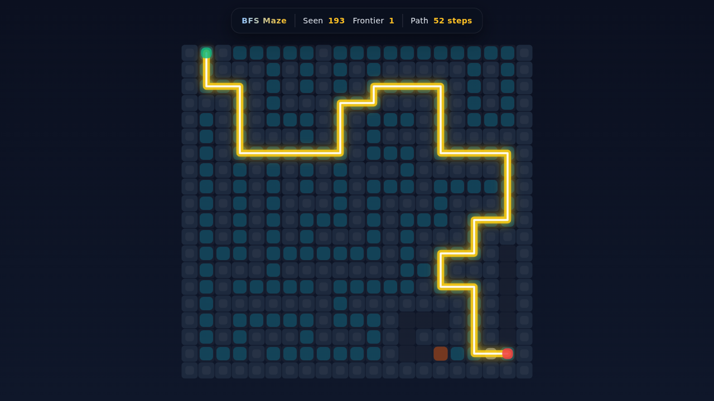
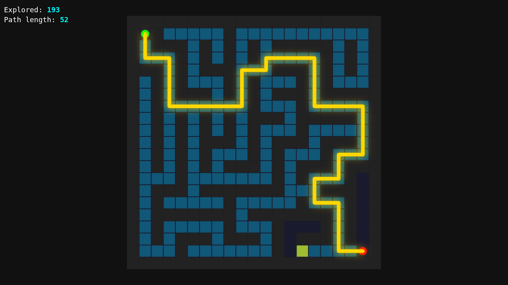

# ⚔️ Duelo: Resolver un laberinto

- **Reto ID:** `maze_solver`
- **Categoría:** `sim`
- **Fecha:** `20260919-034853`
- **Ganador:** 🏆 **or:nvidia/nemotron-3-ultra-550b-a55b:free**

---

### 📸 Capturas del Resultado:

| **A · or:deepseek/deepseek-v4-flash-0731:free** | **B · or:nvidia/nemotron-3-ultra-550b-a55b:free** |
| :---: | :---: |
| <a href="a-or_deepseek_deepseek-v4-flash-0731_free/shot_end.png"></a> | <a href="b-or_nvidia_nemotron-3-ultra-550b-a55b_free/shot_end.png"></a> |
| ⭐ **Nota:** 65/100 · ⏱️ 999.113s | ⭐ **Nota:** 78/100 · ⏱️ 55.317s |

---

### 🌐 Probar en vivo (en el navegador):
- **A · or:deepseek/deepseek-v4-flash-0731:free:** [🎮 Probar demo interactiva en vivo](https://pub-68274156337740f09cc8dc0055b40362.r2.dev/matches/20260919-034853_maze_solver/a/index.html)
- **B · or:nvidia/nemotron-3-ultra-550b-a55b:free:** [🎮 Probar demo interactiva en vivo](https://pub-68274156337740f09cc8dc0055b40362.r2.dev/matches/20260919-034853_maze_solver/b/index.html)

---

### 📝 Prompt suministrado a ambos modelos:
> Here is a maze as text (21 rows x 21 columns): '#' is a wall, '.' is open floor, 'S' is the start and 'E' is the exit. Movement is only up, down, left or right.

#####################
#S#.....#...........#
#.###.#.#.#.#####.#.#
#...#.#.#.#.....#.#.#
###.#.###...###.#.#.#
#.#.#...#.#...#.#...#
#.#.###.#.#.###.#####
#.#.......#...#.....#
#.#.#.#.#.###.#####.#
#.#.#.#.#.#...#.....#
#.#.#.###.#.###.###.#
#.#.#.#...#.#...#...#
#.#.#.#.###.#.###.###
#...#.......#.#...#.#
#.###.#######...###.#
#.#.....#.....#...#.#
#.#######.#######.#.#
#.#.....#...#...#.#.#
#.#.###.###.#.###.#.#
#...#.......#......E#
#####################

Build a beautiful animated visualization that solves it. Requirements: draw the maze exactly as given (same walls, rows and columns), large and centered; animate a search algorithm exploring the maze step by step (visited cells light up, with a visible frontier); when the exit is found, animate the SHORTEST path from S to E as a glowing line or trail; show a live counter of explored cells and, at the end, the length of the shortest path in steps. Also expose the final path as a global variable `window.solution`: an array of [row, column] pairs (0-based, row 0 is the top line) from S to E inclusive. The animation starts automatically and takes about 8 to 10 seconds in total. Canvas or SVG, full window, no interaction needed.

Requirements: deliver everything in ONE self-contained HTML file (inline CSS and JavaScript; no external resources, CDNs, fonts or images). Reply with the complete file in a single ```html code block.

---

### 📊 Resultados y Métricas:

| Modelo | Nota Juez | Tiempo | Tokens | Coste | Archivos |
| :--- | :---: | :---: | :---: | :---: | :---: |
| **A · or:deepseek/deepseek-v4-flash-0731:free** | 65 / 100 | 999.113 s | 37305 | 0.0000 $ | [Ver código](a-or_deepseek_deepseek-v4-flash-0731_free/) · [🎮 Jugar demo](https://pub-68274156337740f09cc8dc0055b40362.r2.dev/matches/20260919-034853_maze_solver/a/index.html) |
| **B · or:nvidia/nemotron-3-ultra-550b-a55b:free** | 78 / 100 | 55.317 s | 5833 | 0.0000 $ | [Ver código](b-or_nvidia_nemotron-3-ultra-550b-a55b_free/) · [🎮 Jugar demo](https://pub-68274156337740f09cc8dc0055b40362.r2.dev/matches/20260919-034853_maze_solver/b/index.html) |

---

### 🎮 Cómo probarlo en local:
Puedes abrir directamente en tu navegador cualquiera de los archivos `index.html` dentro de cada carpeta de contendiente.

*Generado automáticamente por el pipeline de [VERSUS](https://github.com/grawwww-ai/versus-lab).*
