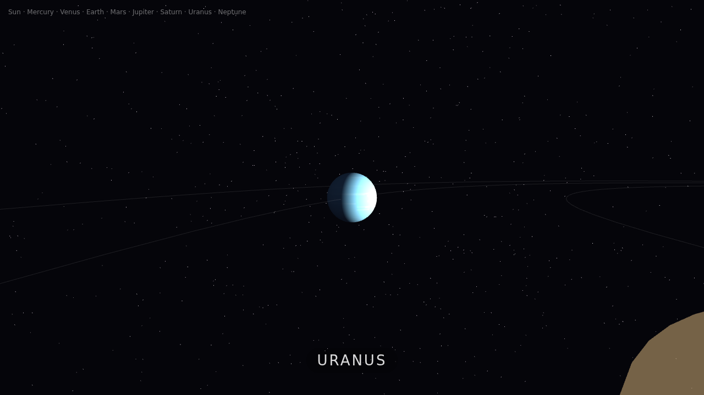

# ⚔️ Duelo: Sistema solar en 3D

- **Reto ID:** `solar_system_3d`
- **Categoría:** `3d`
- **Fecha:** `20260919-040729`
- **Ganador:** 🏆 **or:deepseek/deepseek-v4-flash-0731:free**

---

### 📸 Capturas del Resultado:

| **A · or:deepseek/deepseek-v4-flash-0731:free** | **B · or:nvidia/nemotron-3-ultra-550b-a55b:free** |
| :---: | :---: |
| <a href="a-or_deepseek_deepseek-v4-flash-0731_free/shot_end.png"></a> | <a href="b-or_nvidia_nemotron-3-ultra-550b-a55b_free/shot_end.png"></a> |
| ⭐ **Nota:** 94/100 · ⏱️ 812.705s | ⭐ **Nota:** 5/100 · ⏱️ 232.651s |

---

### 🌐 Probar en vivo (en el navegador):
- **A · or:deepseek/deepseek-v4-flash-0731:free:** [🎮 Probar demo interactiva en vivo](https://pub-68274156337740f09cc8dc0055b40362.r2.dev/matches/20260919-040729_solar_system_3d/a/index.html)
- **B · or:nvidia/nemotron-3-ultra-550b-a55b:free:** [🎮 Probar demo interactiva en vivo](https://pub-68274156337740f09cc8dc0055b40362.r2.dev/matches/20260919-040729_solar_system_3d/b/index.html)

---

### 📝 Prompt suministrado a ambos modelos:
> Using three.js, build a beautiful 3D model of the Solar System with a cinematic tour. Requirements: the Sun glowing at the centre (emissive, with a halo) lighting the planets; the 8 planets in the correct order (Mercury, Venus, Earth, Mars, Jupiter, Saturn, Uranus, Neptune), with relative sizes that make sense (Jupiter the largest, Mercury the smallest), procedural textures on canvas (Jupiter's bands, Earth's oceans and continents, Mars red), Saturn with its rings, the Moon orbiting the Earth; faint orbit lines; planets orbiting at different speeds; a starfield background; a camera that travels from planet to planet showing each one close up with its name on screen. Use the requestAnimationFrame timestamp for animation time. Full-window canvas that handles resizing. Starts automatically, no interaction needed.

three.js (r186) is available as an ES module: use `import * as THREE from 'three'` and addons from 'three/addons/...' (e.g. 'three/addons/controls/OrbitControls.js') inside <script type="module">. An import map is provided for you: do not add your own import map or any CDN URL.

Requirements: deliver everything in ONE self-contained HTML file (inline CSS and JavaScript; no external resources, CDNs, fonts or images). Reply with the complete file in a single ```html code block.

---

### 📊 Resultados y Métricas:

| Modelo | Nota Juez | Tiempo | Tokens | Coste | Archivos |
| :--- | :---: | :---: | :---: | :---: | :---: |
| **A · or:deepseek/deepseek-v4-flash-0731:free** | 94 / 100 | 812.705 s | 30139 | 0.0000 $ | [Ver código](a-or_deepseek_deepseek-v4-flash-0731_free/) · [🎮 Jugar demo](https://pub-68274156337740f09cc8dc0055b40362.r2.dev/matches/20260919-040729_solar_system_3d/a/index.html) |
| **B · or:nvidia/nemotron-3-ultra-550b-a55b:free** | 5 / 100 | 232.651 s | 9465 | 0.0000 $ | [Ver código](b-or_nvidia_nemotron-3-ultra-550b-a55b_free/) · [🎮 Jugar demo](https://pub-68274156337740f09cc8dc0055b40362.r2.dev/matches/20260919-040729_solar_system_3d/b/index.html) |

---

### 🎮 Cómo probarlo en local:
Puedes abrir directamente en tu navegador cualquiera de los archivos `index.html` dentro de cada carpeta de contendiente.

*Generado automáticamente por el pipeline de [VERSUS](https://github.com/grawwww-ai/versus-lab).*
