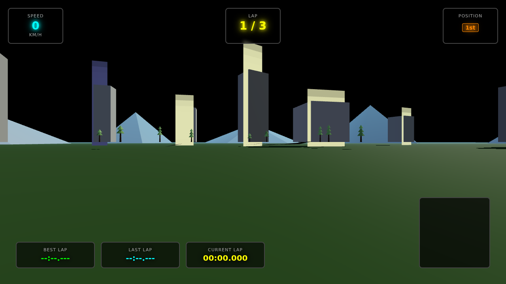

# ⚔️ Duelo: Carreras 3D

- **Reto ID:** `racing_3d`
- **Categoría:** `3d`
- **Fecha:** `20260919-041948`
- **Ganador:** 🏆 **or:nvidia/nemotron-3-ultra-550b-a55b:free**

---

### 📸 Capturas del Resultado:

| **A · or:deepseek/deepseek-v4-flash-0731:free** | **B · or:nvidia/nemotron-3-ultra-550b-a55b:free** |
| :---: | :---: |
| *(Sin captura visual)* | <a href="b-or_nvidia_nemotron-3-ultra-550b-a55b_free/shot_end.png"></a> |
| ⭐ **Nota:** 0/100 · ⏱️ 737.675s | ⭐ **Nota:** 31/100 · ⏱️ 268.366s |

---

### 🌐 Probar en vivo (en el navegador):
- **B · or:nvidia/nemotron-3-ultra-550b-a55b:free:** [🎮 Probar demo interactiva en vivo](https://pub-68274156337740f09cc8dc0055b40362.r2.dev/matches/20260919-041948_racing_3d/b/index.html)

---

### 📝 Prompt suministrado a ambos modelos:
> Using three.js, create a 3D racing scene that drives itself, in the style of an arcade racing game. Requirements: a closed race track with curves, kerbs and a start/finish line, built procedurally, on a landscape with grass, trees or buildings and a sky; a detailed player car modelled from primitives (body, wheels that spin, lights) and at least three rival cars in different colours; all cars are driven by an AI that follows the racing line around the track, overtaking each other; a chase camera behind the player car with a sense of speed; a HUD with speed, lap counter (Lap 1/3) and race position (e.g. 2nd). Use the requestAnimationFrame timestamp for animation time. Full-window canvas that handles resizing. Starts automatically, no interaction needed.

three.js (r186) is available as an ES module: use `import * as THREE from 'three'` and addons from 'three/addons/...' (e.g. 'three/addons/controls/OrbitControls.js') inside <script type="module">. An import map is provided for you: do not add your own import map or any CDN URL.

Requirements: deliver everything in ONE self-contained HTML file (inline CSS and JavaScript; no external resources, CDNs, fonts or images). Reply with the complete file in a single ```html code block.

---

### 📊 Resultados y Métricas:

| Modelo | Nota Juez | Tiempo | Tokens | Coste | Archivos |
| :--- | :---: | :---: | :---: | :---: | :---: |
| **A · or:deepseek/deepseek-v4-flash-0731:free** | 0 / 100 | 737.675 s | 28560 | 0.0000 $ | [Ver código](a-or_deepseek_deepseek-v4-flash-0731_free/)  |
| **B · or:nvidia/nemotron-3-ultra-550b-a55b:free** | 31 / 100 | 268.366 s | 17306 | 0.0000 $ | [Ver código](b-or_nvidia_nemotron-3-ultra-550b-a55b_free/) · [🎮 Jugar demo](https://pub-68274156337740f09cc8dc0055b40362.r2.dev/matches/20260919-041948_racing_3d/b/index.html) |

---

### 🎮 Cómo probarlo en local:
Puedes abrir directamente en tu navegador cualquiera de los archivos `index.html` dentro de cada carpeta de contendiente.

*Generado automáticamente por el pipeline de [VERSUS](https://github.com/grawwww-ai/versus-lab).*
