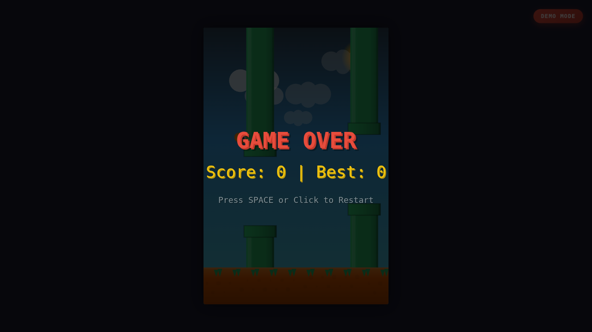

# ⚔️ Duelo: Gravedad Flappy

- **Reto ID:** `flappy`
- **Categoría:** `game`
- **Fecha:** `20260921-001355`
- **Ganador:** 🏆 **or:nvidia/nemotron-3-ultra-550b-a55b:free**

---

### 📸 Capturas del Resultado:

| **A · or:z-ai/glm-5.2:free** | **B · or:nvidia/nemotron-3-ultra-550b-a55b:free** |
| :---: | :---: |
| *(Sin captura visual)* | <a href="b-or_nvidia_nemotron-3-ultra-550b-a55b_free/shot_end.png"></a> |
| ⭐ **Nota:** 0/100 · ⏱️ 0.492s | ⭐ **Nota:** 100/100 · ⏱️ 126.147s |

---

### 🌐 Probar en vivo (en el navegador):
- **B · or:nvidia/nemotron-3-ultra-550b-a55b:free:** [🎮 Probar demo interactiva en vivo](https://pub-68274156337740f09cc8dc0055b40362.r2.dev/matches/20260921-001355_flappy/b/index.html)

---

### 📝 Prompt suministrado a ambos modelos:
> Generate a single HTML file containing a Flappy Bird clone using HTML5 Canvas. A bird icon must be controlled by the player. Physics: constant downward gravity, upward impulse on input. Obstacles are vertical pipes with random gaps. Collision detection must be precise. Score increases when passing pipes. Game over on collision with pipes or ground. Display score prominently. Controls: Space key for jump. Auto-start on load. No external assets, images, or libraries. All graphics drawn via Canvas API. The animation should show everything important within the first 30 seconds (that is the window we record); it may loop or continue after that.

Also include an autoplay demo mode toggled with the P key, in which the game plays itself competently (an AI controls the player) so a viewer can watch a good run.

Requirements: deliver everything in ONE self-contained HTML file (inline CSS and JavaScript; no external resources, CDNs, fonts or images). Reply with the complete file in a single ```html code block.

---

### 📊 Resultados y Métricas:

| Modelo | Nota Juez | Tiempo | Tokens | Coste | Archivos |
| :--- | :---: | :---: | :---: | :---: | :---: |
| **A · or:z-ai/glm-5.2:free** | 0 / 100 | 0.492 s | 0 | 0.0000 $ | [Ver código](a-or_z-ai_glm-5.2_free/)  |
| **B · or:nvidia/nemotron-3-ultra-550b-a55b:free** | 100 / 100 | 126.147 s | 6980 | 0.0000 $ | [Ver código](b-or_nvidia_nemotron-3-ultra-550b-a55b_free/) · [🎮 Jugar demo](https://pub-68274156337740f09cc8dc0055b40362.r2.dev/matches/20260921-001355_flappy/b/index.html) |

---

### 🎮 Cómo probarlo en local:
Puedes abrir directamente en tu navegador cualquiera de los archivos `index.html` dentro de cada carpeta de contendiente.

*Generado automáticamente por el pipeline de [VERSUS](https://github.com/grawwww-ai/versus-lab).*
