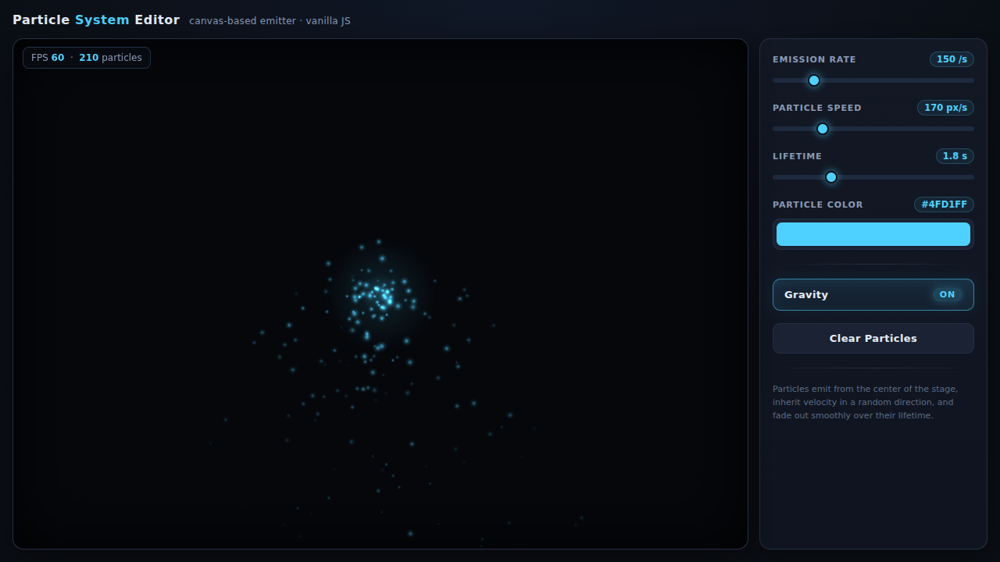
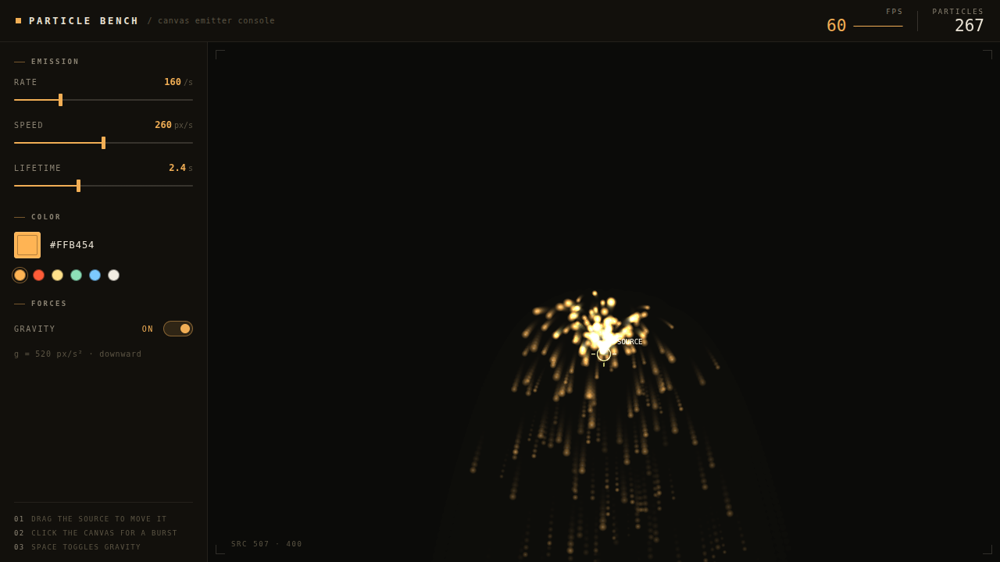

# ⚔️ Duelo: Editor de Partículas

- **Reto ID:** `particle_editor`
- **Categoría:** `web`
- **Fecha:** `20260921-073324`
- **Ganador:** 🏆 **or:z-ai/glm-5.3-flash**

---

### 📸 Capturas del Resultado:

| **A · or:deepseek/deepseek-v4.1-flash** | **B · or:z-ai/glm-5.3-flash** |
| :---: | :---: |
| <a href="a-or_deepseek_deepseek-v4.1-flash/shot_end.png"></a> | <a href="b-or_z-ai_glm-5.3-flash/shot_end.png"></a> |
| ⭐ **Nota:** 91/100 · ⏱️ 421.993s | ⭐ **Nota:** 96/100 · ⏱️ 223.771s |

---

### 🌐 Probar en vivo (en el navegador):
- **A · or:deepseek/deepseek-v4.1-flash:** [🎮 Probar demo interactiva en vivo](https://pub-68274156337740f09cc8dc0055b40362.r2.dev/matches/20260921-073324_particle_editor/a/index.html)
- **B · or:z-ai/glm-5.3-flash:** [🎮 Probar demo interactiva en vivo](https://pub-68274156337740f09cc8dc0055b40362.r2.dev/matches/20260921-073324_particle_editor/b/index.html)

---

### 📝 Prompt suministrado a ambos modelos:
> Generate a single HTML file with a canvas-based particle system editor. A central canvas displays particles emitting from a source point. Controls: Sliders for emission rate, particle speed, and lifetime. A color picker for particle color. A button to toggle gravity on/off. Particles fade out over time. Display FPS counter. All UI elements styled with CSS. No external libraries. Vanilla JS for logic and rendering. Auto-start with default values.

Requirements: deliver everything in ONE self-contained HTML file (inline CSS and JavaScript; no external resources, CDNs, fonts or images). Reply with the complete file in a single ```html code block.

---

### 📊 Resultados y Métricas:

| Modelo | Nota Juez | Tiempo | Tokens | Coste | Archivos |
| :--- | :---: | :---: | :---: | :---: | :---: |
| **A · or:deepseek/deepseek-v4.1-flash** | 91 / 100 | 421.993 s | 12516 | 0.0065 $ | [Ver código](a-or_deepseek_deepseek-v4.1-flash/) · [🎮 Jugar demo](https://pub-68274156337740f09cc8dc0055b40362.r2.dev/matches/20260921-073324_particle_editor/a/index.html) |
| **B · or:z-ai/glm-5.3-flash** | 96 / 100 | 223.771 s | 33170 | 0.0166 $ | [Ver código](b-or_z-ai_glm-5.3-flash/) · [🎮 Jugar demo](https://pub-68274156337740f09cc8dc0055b40362.r2.dev/matches/20260921-073324_particle_editor/b/index.html) |

---

### 🎮 Cómo probarlo en local:
Puedes abrir directamente en tu navegador cualquiera de los archivos `index.html` dentro de cada carpeta de contendiente.

*Generado automáticamente por el pipeline de [VERSUS](https://github.com/grawwww-ai/versus-lab).*
