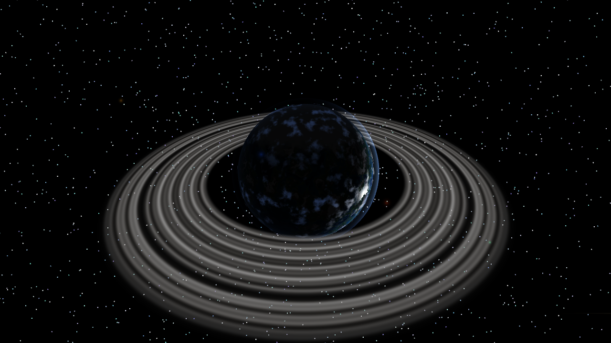

# ⚔️ Duelo: Planeta alienígena

- **Reto ID:** `planet_3d`
- **Categoría:** `3d`
- **Fecha:** `20260921-074506`
- **Ganador:** 🏆 **or:deepseek/deepseek-v4.1-flash**

---

### 📸 Capturas del Resultado:

| **A · or:deepseek/deepseek-v4.1-flash** | **B · or:z-ai/glm-5.3-flash** |
| :---: | :---: |
| <a href="a-or_deepseek_deepseek-v4.1-flash/shot_end.png"></a> | <a href="b-or_z-ai_glm-5.3-flash/shot_end.png"></a> |
| ⭐ **Nota:** 67/100 · ⏱️ 5525.71s | ⭐ **Nota:** 9/100 · ⏱️ 1800.515s |

---

### 🌐 Probar en vivo (en el navegador):
- **A · or:deepseek/deepseek-v4.1-flash:** [🎮 Probar demo interactiva en vivo](https://pub-68274156337740f09cc8dc0055b40362.r2.dev/matches/20260921-074506_planet_3d/a/index.html)
- **B · or:z-ai/glm-5.3-flash:** [🎮 Probar demo interactiva en vivo](https://pub-68274156337740f09cc8dc0055b40362.r2.dev/matches/20260921-074506_planet_3d/b/index.html)

---

### 📝 Prompt suministrado a ambos modelos:
> Using three.js, render a procedurally generated alien planet seen from orbit. Requirements: a planet with a custom shader for terrain colors (oceans, continents, ice caps) based on 3D noise, a slowly rotating cloud layer, a glowing atmospheric rim (fresnel), a ring system with transparency, a small moon orbiting the planet that casts light and shadow interest, a distant sun with a lens-flare-like glow, and a dense starfield. The camera slowly drifts around the planet. Use the requestAnimationFrame timestamp for animation time. Full-window canvas that handles resizing. Starts automatically, no interaction needed. The animation should show everything important within the first 30 seconds (that is the window we record); it may loop or continue after that.

three.js (r186) is available as an ES module: use `import * as THREE from 'three'` and addons from 'three/addons/...' (e.g. 'three/addons/controls/OrbitControls.js') inside <script type="module">. An import map is provided for you: do not add your own import map or any CDN URL.

Requirements: deliver everything in ONE self-contained HTML file (inline CSS and JavaScript; no external resources, CDNs, fonts or images). Reply with the complete file in a single ```html code block.

---

### 📊 Resultados y Métricas:

| Modelo | Nota Juez | Tiempo | Tokens | Coste | Archivos |
| :--- | :---: | :---: | :---: | :---: | :---: |
| **A · or:deepseek/deepseek-v4.1-flash** | 67 / 100 | 5525.71 s | 40202 | 0.0193 $ | [Ver código](a-or_deepseek_deepseek-v4.1-flash/) · [🎮 Jugar demo](https://pub-68274156337740f09cc8dc0055b40362.r2.dev/matches/20260921-074506_planet_3d/a/index.html) |
| **B · or:z-ai/glm-5.3-flash** | 9 / 100 | 1800.515 s | 97378 | 0.0000 $ | [Ver código](b-or_z-ai_glm-5.3-flash/) · [🎮 Jugar demo](https://pub-68274156337740f09cc8dc0055b40362.r2.dev/matches/20260921-074506_planet_3d/b/index.html) |

---

### 🎮 Cómo probarlo en local:
Puedes abrir directamente en tu navegador cualquiera de los archivos `index.html` dentro de cada carpeta de contendiente.

*Generado automáticamente por el pipeline de [VERSUS](https://github.com/grawwww-ai/versus-lab).*
