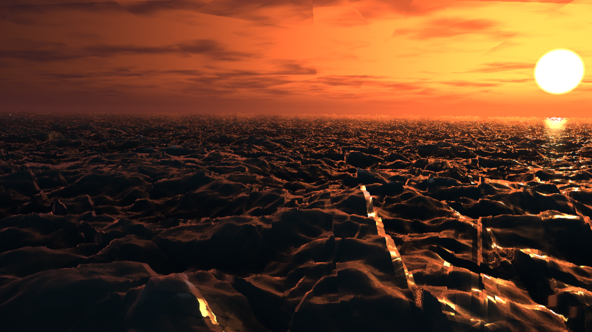
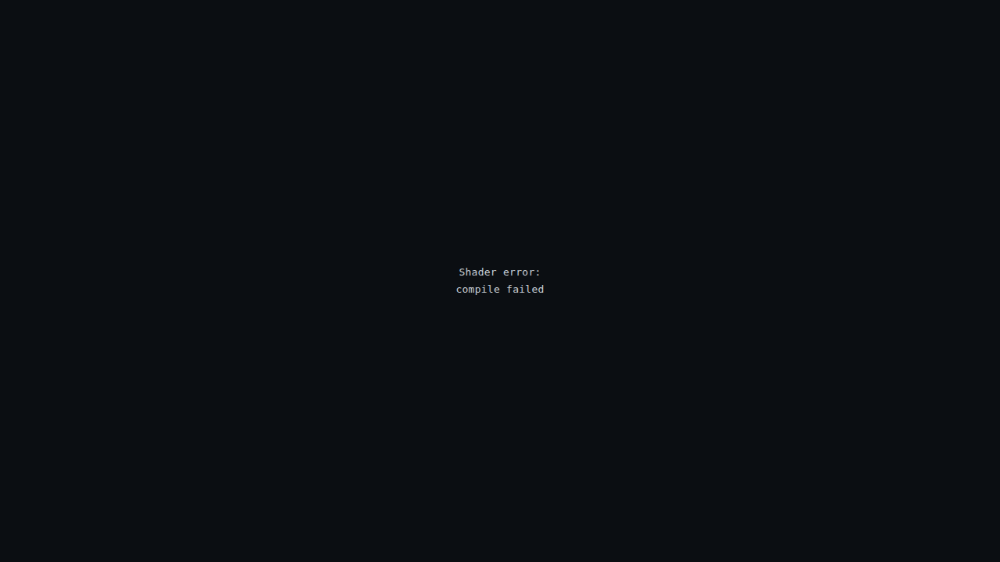

# ⚔️ Duelo: Océano en tormenta

- **Reto ID:** `shader_ocean`
- **Categoría:** `shader`
- **Fecha:** `20260921-091903`
- **Ganador:** 🏆 **or:deepseek/deepseek-v4.1-flash**

---

### 📸 Capturas del Resultado:

| **A · or:deepseek/deepseek-v4.1-flash** | **B · or:z-ai/glm-5.3-flash** |
| :---: | :---: |
| <a href="a-or_deepseek_deepseek-v4.1-flash/shot_end.png"></a> | <a href="b-or_z-ai_glm-5.3-flash/shot_end.png"></a> |
| ⭐ **Nota:** 67/100 · ⏱️ 978.619s | ⭐ **Nota:** 13/100 · ⏱️ 1056.56s |

---

### 🌐 Probar en vivo (en el navegador):
- **A · or:deepseek/deepseek-v4.1-flash:** [🎮 Probar demo interactiva en vivo](https://pub-68274156337740f09cc8dc0055b40362.r2.dev/matches/20260921-091903_shader_ocean/a/index.html)
- **B · or:z-ai/glm-5.3-flash:** [🎮 Probar demo interactiva en vivo](https://pub-68274156337740f09cc8dc0055b40362.r2.dev/matches/20260921-091903_shader_ocean/b/index.html)

---

### 📝 Prompt suministrado a ambos modelos:
> Create a full-window WebGL2 animation of a stormy ocean at sunset, written as a single raymarching fragment shader on a full-screen quad (raw WebGL2, no libraries). Requirements: large rolling waves built from several octaves of noise, foam on the crests, a dramatic sky with dark clouds and a low orange sun, sun reflection and fresnel on the water, subtle fog near the horizon, and a camera that gently bobs as if on a boat. Use the requestAnimationFrame timestamp for time. The canvas must always fill the window and handle resizing. Starts automatically, no interaction needed. The animation should show everything important within the first 30 seconds (that is the window we record); it may loop or continue after that.

Requirements: deliver everything in ONE self-contained HTML file (inline CSS and JavaScript; no external resources, CDNs, fonts or images). Reply with the complete file in a single ```html code block.

---

### 📊 Resultados y Métricas:

| Modelo | Nota Juez | Tiempo | Tokens | Coste | Archivos |
| :--- | :---: | :---: | :---: | :---: | :---: |
| **A · or:deepseek/deepseek-v4.1-flash** | 67 / 100 | 978.619 s | 40491 | 0.0487 $ | [Ver código](a-or_deepseek_deepseek-v4.1-flash/) · [🎮 Jugar demo](https://pub-68274156337740f09cc8dc0055b40362.r2.dev/matches/20260921-091903_shader_ocean/a/index.html) |
| **B · or:z-ai/glm-5.3-flash** | 13 / 100 | 1056.56 s | 68240 | 0.0342 $ | [Ver código](b-or_z-ai_glm-5.3-flash/) · [🎮 Jugar demo](https://pub-68274156337740f09cc8dc0055b40362.r2.dev/matches/20260921-091903_shader_ocean/b/index.html) |

---

### 🎮 Cómo probarlo en local:
Puedes abrir directamente en tu navegador cualquiera de los archivos `index.html` dentro de cada carpeta de contendiente.

*Generado automáticamente por el pipeline de [VERSUS](https://github.com/grawwww-ai/versus-lab).*
