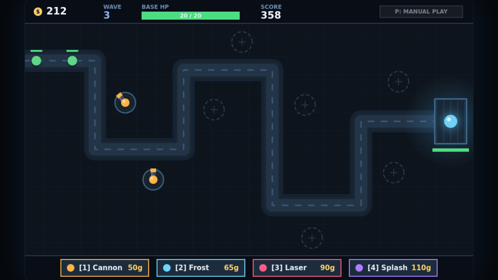
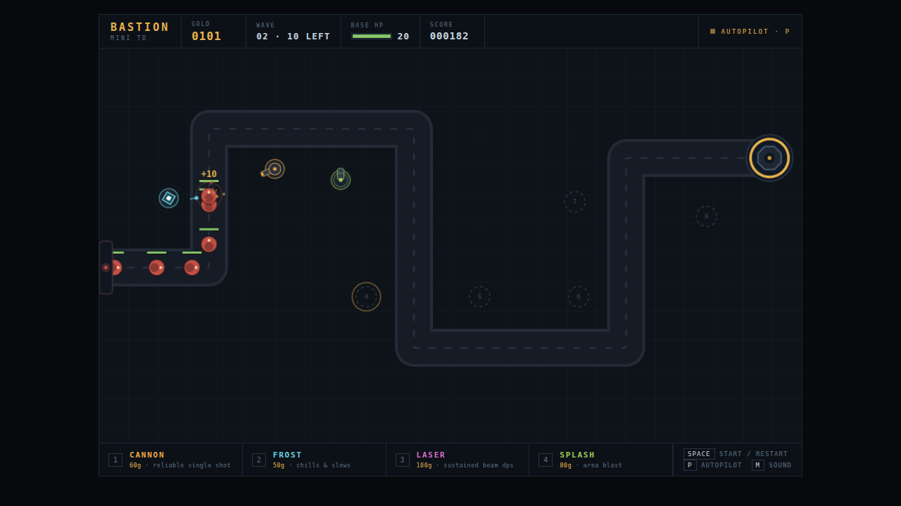

# ⚔️ Duelo: Defensa Mini

- **Reto ID:** `tower_defense`
- **Categoría:** `game`
- **Fecha:** `20260921-100349`
- **Ganador:** 🏆 **or:z-ai/glm-5.3-flash**

---

### 📸 Capturas del Resultado:

| **A · or:deepseek/deepseek-v4.1-flash** | **B · or:z-ai/glm-5.3-flash** |
| :---: | :---: |
| <a href="a-or_deepseek_deepseek-v4.1-flash/shot_end.png"></a> | <a href="b-or_z-ai_glm-5.3-flash/shot_end.png"></a> |
| ⭐ **Nota:** 70/100 · ⏱️ 1252.39s | ⭐ **Nota:** 76/100 · ⏱️ 1463.529s |

---

### 🌐 Probar en vivo (en el navegador):
- **A · or:deepseek/deepseek-v4.1-flash:** [🎮 Probar demo interactiva en vivo](https://pub-68274156337740f09cc8dc0055b40362.r2.dev/matches/20260921-100349_tower_defense/a/index.html)
- **B · or:z-ai/glm-5.3-flash:** [🎮 Probar demo interactiva en vivo](https://pub-68274156337740f09cc8dc0055b40362.r2.dev/matches/20260921-100349_tower_defense/b/index.html)

---

### 📝 Prompt suministrado a ambos modelos:
> Create a mini Tower Defense game on an HTML5 Canvas. Enemies spawn at the left edge and follow a winding path to a base on the right. There are 8 fixed tower slots along the path. Keys 1-4 buy a tower of that type (cannon, frost, laser, splash) and place it in the next free slot if the player has enough gold. Towers shoot automatically; enemies have health bars and give gold when killed. Waves get harder. The base has limited HP; the game ends when it reaches 0. Show gold, wave, base HP and score. Space starts or restarts. Place one free cannon at start so the first wave is playable. The animation should show everything important within the first 30 seconds (that is the window we record); it may loop or continue after that.

Also include an autoplay demo mode toggled with the P key, in which the game plays itself competently (an AI controls the player) so a viewer can watch a good run.

Requirements: deliver everything in ONE self-contained HTML file (inline CSS and JavaScript; no external resources, CDNs, fonts or images). Reply with the complete file in a single ```html code block.

---

### 📊 Resultados y Métricas:

| Modelo | Nota Juez | Tiempo | Tokens | Coste | Archivos |
| :--- | :---: | :---: | :---: | :---: | :---: |
| **A · or:deepseek/deepseek-v4.1-flash** | 70 / 100 | 1252.39 s | 35742 | 0.0215 $ | [Ver código](a-or_deepseek_deepseek-v4.1-flash/) · [🎮 Jugar demo](https://pub-68274156337740f09cc8dc0055b40362.r2.dev/matches/20260921-100349_tower_defense/a/index.html) |
| **B · or:z-ai/glm-5.3-flash** | 76 / 100 | 1463.529 s | 60314 | 0.0181 $ | [Ver código](b-or_z-ai_glm-5.3-flash/) · [🎮 Jugar demo](https://pub-68274156337740f09cc8dc0055b40362.r2.dev/matches/20260921-100349_tower_defense/b/index.html) |

---

### 🎮 Cómo probarlo en local:
Puedes abrir directamente en tu navegador cualquiera de los archivos `index.html` dentro de cada carpeta de contendiente.

*Generado automáticamente por el pipeline de [VERSUS](https://github.com/grawwww-ai/versus-lab).*
