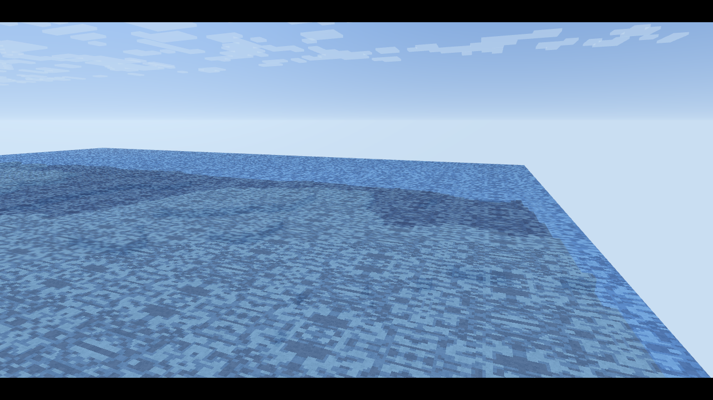

# ⚔️ Duelo: Mundo tipo Minecraft

- **Reto ID:** `voxel_world`
- **Categoría:** `3d`
- **Fecha:** `20260921-103049`
- **Ganador:** 🏆 **or:deepseek/deepseek-v4.1-flash**

---

### 📸 Capturas del Resultado:

| **A · or:deepseek/deepseek-v4.1-flash** | **B · or:z-ai/glm-5.3-flash** |
| :---: | :---: |
| <a href="a-or_deepseek_deepseek-v4.1-flash/shot_end.png"></a> | <a href="b-or_z-ai_glm-5.3-flash/shot_end.png"></a> |
| ⭐ **Nota:** 89/100 · ⏱️ 2158.24s | ⭐ **Nota:** 74/100 · ⏱️ 748.286s |

---

### 🌐 Probar en vivo (en el navegador):
- **A · or:deepseek/deepseek-v4.1-flash:** [🎮 Probar demo interactiva en vivo](https://pub-68274156337740f09cc8dc0055b40362.r2.dev/matches/20260921-103049_voxel_world/a/index.html)
- **B · or:z-ai/glm-5.3-flash:** [🎮 Probar demo interactiva en vivo](https://pub-68274156337740f09cc8dc0055b40362.r2.dev/matches/20260921-103049_voxel_world/b/index.html)

---

### 📝 Prompt suministrado a ambos modelos:
> Using three.js, build a Minecraft-style voxel world and show it off with a cinematic flythrough. Requirements: a procedurally generated terrain of cube blocks (at least 128x128 columns) using layered noise, with grass-topped hills, snowy mountain peaks, sandy beaches, a lake or sea with semi-transparent water, and trees made of wood and leaf blocks; blocks must have per-face shading so the cube shapes read clearly (draw the block textures procedurally on a canvas, pixel-art style); a sky with a sun, soft distance fog and fluffy block clouds that drift slowly. Use InstancedMesh or merged geometry so it runs smoothly. The camera flies automatically over and between the hills on a smooth path, looking around the landscape. Use the requestAnimationFrame timestamp for animation time. Full-window canvas that handles resizing. Starts automatically, no interaction needed. The animation should show everything important within the first 30 seconds (that is the window we record); it may loop or continue after that.

three.js (r186) is available as an ES module: use `import * as THREE from 'three'` and addons from 'three/addons/...' (e.g. 'three/addons/controls/OrbitControls.js') inside <script type="module">. An import map is provided for you: do not add your own import map or any CDN URL.

Requirements: deliver everything in ONE self-contained HTML file (inline CSS and JavaScript; no external resources, CDNs, fonts or images). Reply with the complete file in a single ```html code block.

---

### 📊 Resultados y Métricas:

| Modelo | Nota Juez | Tiempo | Tokens | Coste | Archivos |
| :--- | :---: | :---: | :---: | :---: | :---: |
| **A · or:deepseek/deepseek-v4.1-flash** | 89 / 100 | 2158.24 s | 60631 | 0.0364 $ | [Ver código](a-or_deepseek_deepseek-v4.1-flash/) · [🎮 Jugar demo](https://pub-68274156337740f09cc8dc0055b40362.r2.dev/matches/20260921-103049_voxel_world/a/index.html) |
| **B · or:z-ai/glm-5.3-flash** | 74 / 100 | 748.286 s | 91097 | 0.0456 $ | [Ver código](b-or_z-ai_glm-5.3-flash/) · [🎮 Jugar demo](https://pub-68274156337740f09cc8dc0055b40362.r2.dev/matches/20260921-103049_voxel_world/b/index.html) |

---

### 🎮 Cómo probarlo en local:
Puedes abrir directamente en tu navegador cualquiera de los archivos `index.html` dentro de cada carpeta de contendiente.

*Generado automáticamente por el pipeline de [VERSUS](https://github.com/grawwww-ai/versus-lab).*
