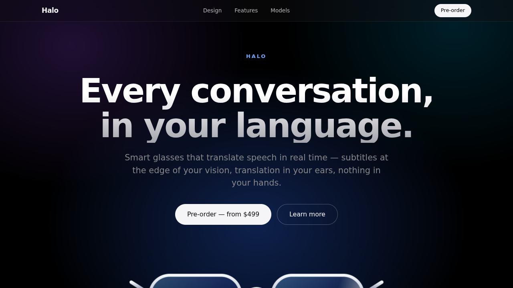
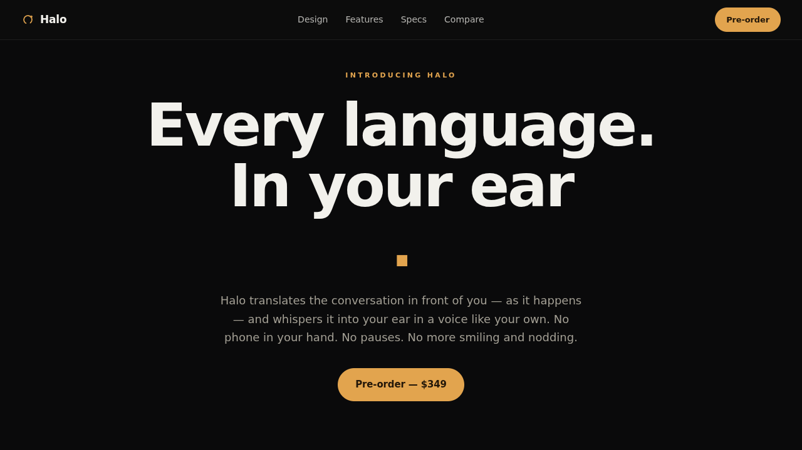

# ⚔️ Duelo: Web de producto estilo Apple

- **Reto ID:** `product_page`
- **Categoría:** `web`
- **Fecha:** `20260921-132610`
- **Ganador:** 🏆 **or:deepseek/deepseek-v4.1-flash**

---

### 📸 Capturas del Resultado:

| **A · or:deepseek/deepseek-v4.1-flash** | **B · or:z-ai/glm-5.3-flash** |
| :---: | :---: |
| <a href="a-or_deepseek_deepseek-v4.1-flash/shot_end.png"></a> | <a href="b-or_z-ai_glm-5.3-flash/shot_end.png"></a> |
| ⭐ **Nota:** 93/100 · ⏱️ 108.118s | ⭐ **Nota:** 91/100 · ⏱️ 671.817s |

---

### 🌐 Probar en vivo (en el navegador):
- **A · or:deepseek/deepseek-v4.1-flash:** [🎮 Probar demo interactiva en vivo](https://pub-68274156337740f09cc8dc0055b40362.r2.dev/matches/20260921-132610_product_page/a/index.html)
- **B · or:z-ai/glm-5.3-flash:** [🎮 Probar demo interactiva en vivo](https://pub-68274156337740f09cc8dc0055b40362.r2.dev/matches/20260921-132610_product_page/b/index.html)

---

### 📝 Prompt suministrado a ambos modelos:
> Design a premium product landing page, in the style of Apple's product pages, for an invented product: "Halo", a pair of smart glasses that translate any conversation in real time. Requirements: a full-screen hero with a large headline and a product illustration drawn with inline SVG and CSS (no images); scroll-driven animations (elements fade, slide and scale in as you scroll, using IntersectionObserver or scroll events); a sticky section where the product rotates or transforms as you scroll; a features grid, a section with big animated numbers (battery life, languages, weight), a comparison of two models and a pre-order call to action. Elegant typography using system fonts, generous white space, smooth transitions, and a dark and a light section. Everything inline, no external resources.

Requirements: deliver everything in ONE self-contained HTML file (inline CSS and JavaScript; no external resources, CDNs, fonts or images). Reply with the complete file in a single ```html code block.

---

### 📊 Resultados y Métricas:

| Modelo | Nota Juez | Tiempo | Tokens | Coste | Archivos |
| :--- | :---: | :---: | :---: | :---: | :---: |
| **A · or:deepseek/deepseek-v4.1-flash** | 93 / 100 | 108.118 s | 30059 | 0.0361 $ | [Ver código](a-or_deepseek_deepseek-v4.1-flash/) · [🎮 Jugar demo](https://pub-68274156337740f09cc8dc0055b40362.r2.dev/matches/20260921-132610_product_page/a/index.html) |
| **B · or:z-ai/glm-5.3-flash** | 91 / 100 | 671.817 s | 65882 | 0.0330 $ | [Ver código](b-or_z-ai_glm-5.3-flash/) · [🎮 Jugar demo](https://pub-68274156337740f09cc8dc0055b40362.r2.dev/matches/20260921-132610_product_page/b/index.html) |

---

### 🎮 Cómo probarlo en local:
Puedes abrir directamente en tu navegador cualquiera de los archivos `index.html` dentro de cada carpeta de contendiente.

*Generado automáticamente por el pipeline de [VERSUS](https://github.com/grawwww-ai/versus-lab).*
