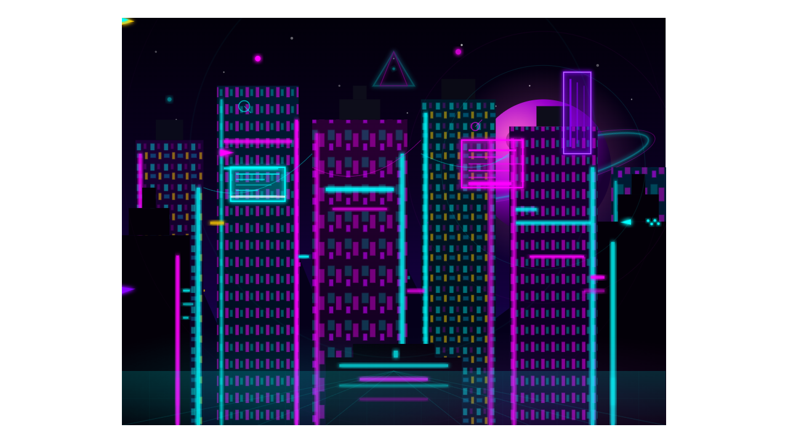
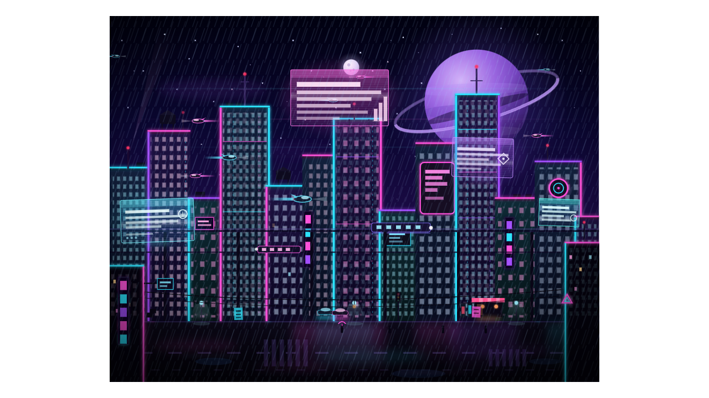

# ⚔️ Duelo: Ciudad Cyberpunk

- **Reto ID:** `cyberpunk_city`
- **Categoría:** `svg`
- **Fecha:** `20260921-140841`
- **Ganador:** 🏆 **or:z-ai/glm-5.3-flash**

---

### 📸 Capturas del Resultado:

| **A · or:deepseek/deepseek-v4.1-flash** | **B · or:z-ai/glm-5.3-flash** |
| :---: | :---: |
| <a href="a-or_deepseek_deepseek-v4.1-flash/shot_end.png"></a> | <a href="b-or_z-ai_glm-5.3-flash/shot_end.png"></a> |
| ⭐ **Nota:** 100/100 · ⏱️ 65.132s | ⭐ **Nota:** 100/100 · ⏱️ 743.368s |

---

### 📝 Prompt suministrado a ambos modelos:
> Return ONLY a valid SVG string, 800x600 viewBox. Draw a futuristic cyberpunk cityscape at night. Include skyscrapers with neon lights (pink, cyan, purple). Add a large moon or planet in the background. Include flying vehicles (simple shapes) and holographic billboards (rectangles with text-like lines). Use gradients for sky and building reflections. No external images. Static scene, highly detailed with many small elements. The animation should show everything important within the first 30 seconds (that is the window we record); it may loop or continue after that.

Reply with the complete SVG in a single ```svg code block.

---

### 📊 Resultados y Métricas:

| Modelo | Nota Juez | Tiempo | Tokens | Coste | Archivos |
| :--- | :---: | :---: | :---: | :---: | :---: |
| **A · or:deepseek/deepseek-v4.1-flash** | 100 / 100 | 65.132 s | 14460 | 0.0174 $ | [Ver código](a-or_deepseek_deepseek-v4.1-flash/) |
| **B · or:z-ai/glm-5.3-flash** | 100 / 100 | 743.368 s | 66621 | 0.0333 $ | [Ver código](b-or_z-ai_glm-5.3-flash/) |

---

### 🎮 Cómo probarlo en local:
Puedes abrir directamente en tu navegador cualquiera de los archivos `index.html` dentro de cada carpeta de contendiente.

*Generado automáticamente por el pipeline de [VERSUS](https://github.com/grawwww-ai/versus-lab).*
