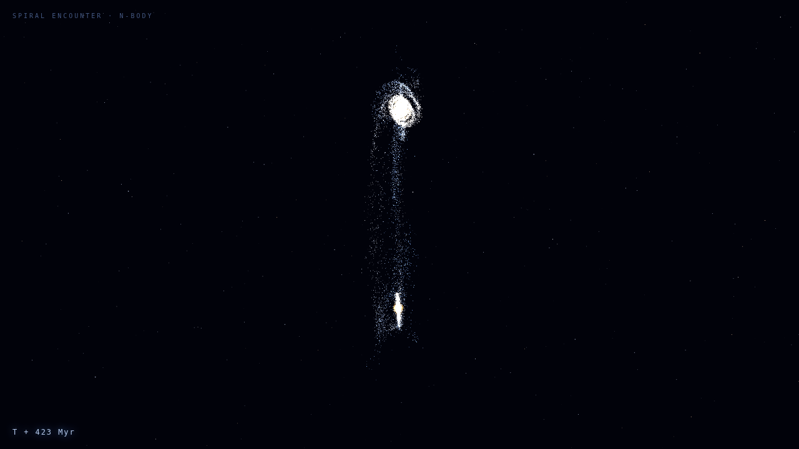
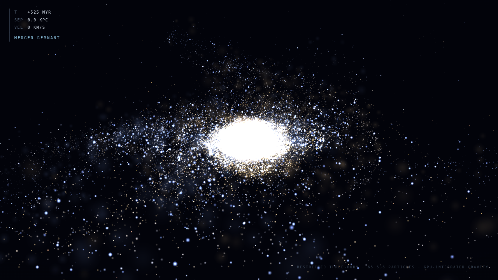

# ⚔️ Duelo: Choque de galaxias

- **Reto ID:** `galaxy_collision`
- **Categoría:** `3d`
- **Fecha:** `20260922-081349`
- **Ganador:** 🏆 **or:deepseek/deepseek-v4.1-flash**

---

### 📸 Capturas del Resultado:

| **A · or:deepseek/deepseek-v4.1-flash** | **B · or:z-ai/glm-5.3-flash** |
| :---: | :---: |
| <a href="a-or_deepseek_deepseek-v4.1-flash/shot_end.png"></a> | <a href="b-or_z-ai_glm-5.3-flash/shot_end.png"></a> |
| ⭐ **Nota:** 100/100 · ⏱️ 461.997s | ⭐ **Nota:** 100/100 · ⏱️ 730.966s |

---

### 📝 Prompt suministrado a ambos modelos:
> Using three.js, simulate two spiral galaxies colliding, as a cinematic scientific visualization. Requirements: two disk galaxies with visible spiral arms and a bright core, each with at least 20,000 stars rendered as glowing points (additive blending), colours going from warm yellow cores to blue-white arms; the galaxies approach each other and interact through gravity, so that during the encounter tidal tails and bridges of stars are pulled out; a slowly orbiting camera that frames the whole event; a dark starfield background; and a small on-screen label with the simulated time in millions of years. Use the requestAnimationFrame timestamp for animation time and run the physics on the GPU or with a cheap approximation so it stays smooth. Full-window canvas that handles resizing. Starts automatically, no interaction needed.

three.js (r186) is available as an ES module: use `import * as THREE from 'three'` and addons from 'three/addons/...' (e.g. 'three/addons/controls/OrbitControls.js') inside <script type="module">. An import map is provided for you: do not add your own import map or any CDN URL.

The animation should show everything important within the first 30 seconds (that is the window we record); it may loop or continue after that.

Requirements: deliver everything in ONE self-contained HTML file (inline CSS and JavaScript; no external resources, CDNs, fonts or images). Reply with the complete file in a single ```html code block.

---

### 📊 Resultados y Métricas:

| Modelo | Nota Juez | Tiempo | Tokens | Coste | Archivos |
| :--- | :---: | :---: | :---: | :---: | :---: |
| **A · or:deepseek/deepseek-v4.1-flash** | 100 / 100 | 461.997 s | 57848 | 0.0695 $ | [Ver código](a-or_deepseek_deepseek-v4.1-flash/) |
| **B · or:z-ai/glm-5.3-flash** | 100 / 100 | 730.966 s | 113360 | 0.0567 $ | [Ver código](b-or_z-ai_glm-5.3-flash/) |

---

### 🎮 Cómo probarlo en local:
Puedes abrir directamente en tu navegador cualquiera de los archivos `index.html` dentro de cada carpeta de contendiente.

*Generado automáticamente por el pipeline de [VERSUS](https://github.com/grawwww-ai/versus-lab).*
