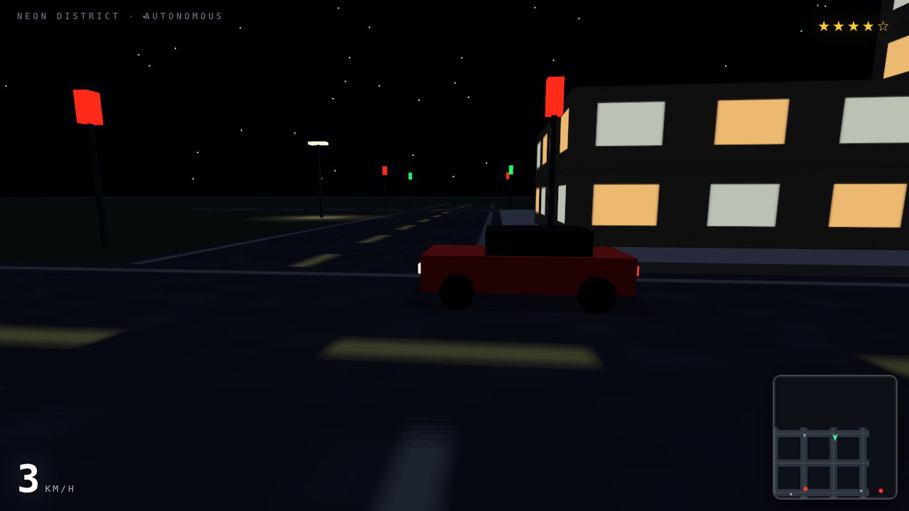
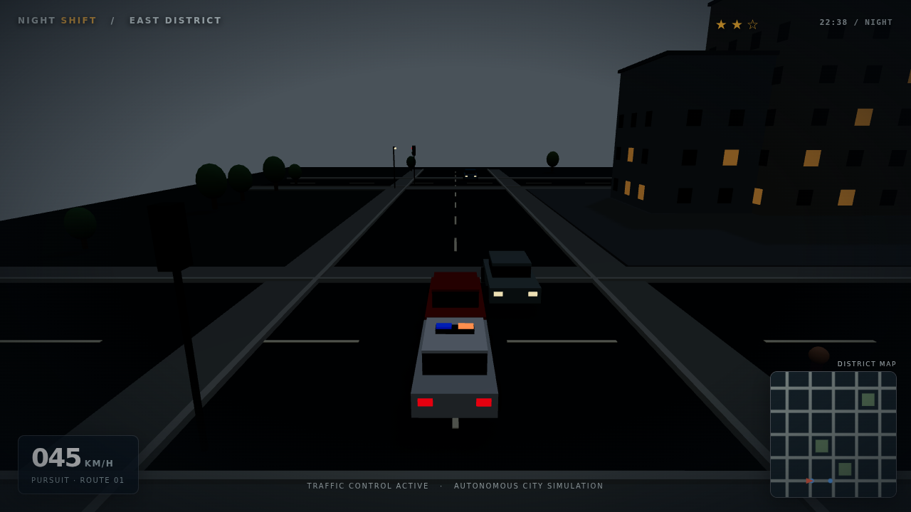

# ⚔️ Duelo: Ciudad abierta estilo GTA

- **Reto ID:** `open_world_city`
- **Categoría:** `3d`
- **Fecha:** `20260924-015454`
- **Ganador:** 🏆 **or:openai/gpt-6-luna-pro**

---

### 📸 Capturas del Resultado:

| **A · or:deepseek/deepseek-v4.1-flash** | **B · or:openai/gpt-6-luna-pro** |
| :---: | :---: |
| <a href="a-or_deepseek_deepseek-v4.1-flash/shot_end.png"></a> | <a href="b-or_openai_gpt-6-luna-pro/shot_end.png"></a> |
| ⭐ **Nota:** 100/100 · ⏱️ 114.354s | ⭐ **Nota:** 100/100 · ⏱️ 142.548s |

---

### 🌐 Probar en vivo (en el navegador):
- **A · or:deepseek/deepseek-v4.1-flash:** [🎮 Probar demo interactiva en vivo](https://pub-68274156337740f09cc8dc0055b40362.r2.dev/matches/20260924-015454_open_world_city/a/index.html)
- **B · or:openai/gpt-6-luna-pro:** [🎮 Probar demo interactiva en vivo](https://pub-68274156337740f09cc8dc0055b40362.r2.dev/matches/20260924-015454_open_world_city/b/index.html)

---

### 📝 Prompt suministrado a ambos modelos:
> Using three.js, build a small open world city that plays itself, in the spirit of GTA: a procedurally generated city district with streets, blocks of buildings with varied facades, pavements, street furniture and parks; traffic with cars that obey lanes and traffic lights, and pedestrians walking the pavements. A hero car drives itself through the city following a route, overtaking, braking at lights and drifting on corners, with a chase camera and occasional cinematic angles. Add a day-night cycle with street lights, a wanted-level chase where police cars pursue the hero car, a minimap in the corner showing streets and the car, and a HUD with speed. Everything self-contained and running on its own from the first second.

three.js (r186) is available as an ES module: use `import * as THREE from 'three'` and addons from 'three/addons/...' (e.g. 'three/addons/controls/OrbitControls.js') inside <script type="module">. An import map is provided for you: do not add your own import map or any CDN URL.

The animation should show everything important within the first 30 seconds (that is the window we record); it may loop or continue after that.

Requirements: deliver everything in ONE self-contained HTML file (inline CSS and JavaScript; no external resources, CDNs, fonts or images). Reply with the complete file in a single ```html code block.

---

### 📊 Resultados y Métricas:

| Modelo | Nota Juez | Tiempo | Tokens | Coste | Archivos |
| :--- | :---: | :---: | :---: | :---: | :---: |
| **A · or:deepseek/deepseek-v4.1-flash** | 100 / 100 | 114.354 s | 52605 | 0.0632 $ | [Ver código](a-or_deepseek_deepseek-v4.1-flash/) |
| **B · or:openai/gpt-6-luna-pro** | 100 / 100 | 142.548 s | 29133 | 0.0172 $ | [Ver código](b-or_openai_gpt-6-luna-pro/) |

---

### 🎮 Cómo probarlo en local:
Puedes abrir directamente en tu navegador cualquiera de los archivos `index.html` dentro de cada carpeta de contendiente.

*Generado automáticamente por el pipeline de [VERSUS](https://github.com/grawwww-ai/versus-lab).*
