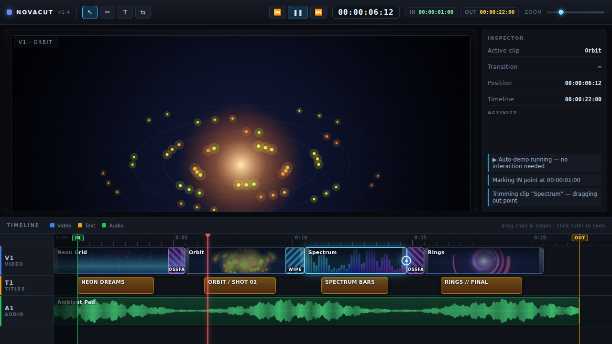
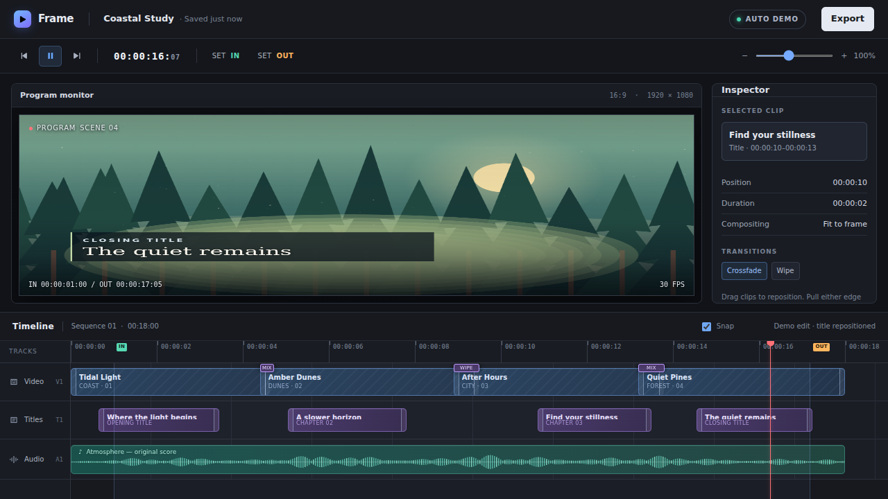

# ⚔️ Duelo: Editor de vídeo en el navegador

- **Reto ID:** `video_editor`
- **Categoría:** `sim`
- **Fecha:** `20260924-015512`
- **Ganador:** 🏆 **or:deepseek/deepseek-v4.1-flash**

---

### 📸 Capturas del Resultado:

| **A · or:deepseek/deepseek-v4.1-flash** | **B · or:openai/gpt-6-luna-pro** |
| :---: | :---: |
| <a href="a-or_deepseek_deepseek-v4.1-flash/shot_end.png"></a> | <a href="b-or_openai_gpt-6-luna-pro/shot_end.png"></a> |
| ⭐ **Nota:** 100/100 · ⏱️ 84.448s | ⭐ **Nota:** 100/100 · ⏱️ 146.935s |

---

### 🌐 Probar en vivo (en el navegador):
- **A · or:deepseek/deepseek-v4.1-flash:** [🎮 Probar demo interactiva en vivo](https://pub-68274156337740f09cc8dc0055b40362.r2.dev/matches/20260924-015512_video_editor/a/index.html)
- **B · or:openai/gpt-6-luna-pro:** [🎮 Probar demo interactiva en vivo](https://pub-68274156337740f09cc8dc0055b40362.r2.dev/matches/20260924-015512_video_editor/b/index.html)

---

### 📝 Prompt suministrado a ambos modelos:
> Build a small video editor in one HTML file: a preview area, a timeline with at least three tracks (video, text, audio) with draggable clips, a playhead that advances, in and out points, transitions between clips (crossfade, wipe) and a text title track. Clips are generated procedurally in code (coloured animated scenes, no external files); the audio track is drawn as a waveform. It must play a DEMO by itself: the playhead runs along the timeline while the preview shows the montage with its transitions and titles, a clip is trimmed and another is moved, all without interaction. Professional dark interface with toolbar, timecode and zoom control.

The animation should show everything important within the first 30 seconds (that is the window we record); it may loop or continue after that.

Requirements: deliver everything in ONE self-contained HTML file (inline CSS and JavaScript; no external resources, CDNs, fonts or images). Reply with the complete file in a single ```html code block.

---

### 📊 Resultados y Métricas:

| Modelo | Nota Juez | Tiempo | Tokens | Coste | Archivos |
| :--- | :---: | :---: | :---: | :---: | :---: |
| **A · or:deepseek/deepseek-v4.1-flash** | 100 / 100 | 84.448 s | 40535 | 0.0487 $ | [Ver código](a-or_deepseek_deepseek-v4.1-flash/) |
| **B · or:openai/gpt-6-luna-pro** | 100 / 100 | 146.935 s | 32623 | 0.0196 $ | [Ver código](b-or_openai_gpt-6-luna-pro/) |

---

### 🎮 Cómo probarlo en local:
Puedes abrir directamente en tu navegador cualquiera de los archivos `index.html` dentro de cada carpeta de contendiente.

*Generado automáticamente por el pipeline de [VERSUS](https://github.com/grawwww-ai/versus-lab).*
