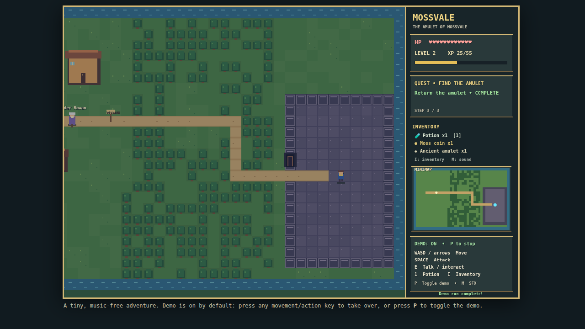

# ⚔️ Duelo: RPG en miniatura

- **Reto ID:** `mini_rpg`
- **Categoría:** `game`
- **Fecha:** `20260924-022729`
- **Ganador:** 🏆 **or:deepseek/deepseek-v4.1-flash**

---

### 📸 Capturas del Resultado:

| **A · or:deepseek/deepseek-v4.1-flash** | **B · or:openai/gpt-6-luna-pro** |
| :---: | :---: |
| <a href="a-or_deepseek_deepseek-v4.1-flash/shot_end.png"></a> | <a href="b-or_openai_gpt-6-luna-pro/shot_end.png"></a> |
| ⭐ **Nota:** 70/100 · ⏱️ 737.809s | ⭐ **Nota:** 60/100 · ⏱️ 165.96s |

---

### 🌐 Probar en vivo (en el navegador):
- **A · or:deepseek/deepseek-v4.1-flash:** [🎮 Probar demo interactiva en vivo](https://pub-68274156337740f09cc8dc0055b40362.r2.dev/matches/20260924-022729_mini_rpg/a/index.html)
- **B · or:openai/gpt-6-luna-pro:** [🎮 Probar demo interactiva en vivo](https://pub-68274156337740f09cc8dc0055b40362.r2.dev/matches/20260924-022729_mini_rpg/b/index.html)

---

### 📝 Prompt suministrado a ambos modelos:
> Create a miniature top-down RPG in one HTML file with pixel art drawn in code: a tiled world with village, forest and dungeon, NPCs with dialogue boxes, a hero with animated walk in four directions, monsters that patrol and chase, turn-based or action combat with damage numbers, experience and level-up, an inventory with a few items, and a quest ('find the amulet') with a visible objective. Include a day-night tint, music-free sound, and a minimap. Autoplay demo mode must be ON by default: the hero walks the world, talks to an NPC, fights a monster and completes a step of the quest by itself, so the whole loop is visible without touching anything.

It must be genuinely PLAYABLE by a human: the player is controlled with the keyboard (and mouse if it helps), the controls are shown on screen at the start, and the game reacts immediately to input. On top of that, include an autoplay demo mode toggled with the P key, in which the game plays itself competently (an AI controls the player) so a viewer can watch a good run; the demo must stop as soon as the player presses a control key, giving control back.

The animation should show everything important within the first 30 seconds (that is the window we record); it may loop or continue after that.

Requirements: deliver everything in ONE self-contained HTML file (inline CSS and JavaScript; no external resources, CDNs, fonts or images). Reply with the complete file in a single ```html code block.

---

### 📊 Resultados y Métricas:

| Modelo | Nota Juez | Tiempo | Tokens | Coste | Archivos |
| :--- | :---: | :---: | :---: | :---: | :---: |
| **A · or:deepseek/deepseek-v4.1-flash** | 70 / 100 | 737.809 s | 68142 | 0.0287 $ | [Ver código](a-or_deepseek_deepseek-v4.1-flash/) · [🎮 Jugar demo](https://pub-68274156337740f09cc8dc0055b40362.r2.dev/matches/20260924-022729_mini_rpg/a/index.html) |
| **B · or:openai/gpt-6-luna-pro** | 60 / 100 | 165.96 s | 26214 | 0.0156 $ | [Ver código](b-or_openai_gpt-6-luna-pro/) · [🎮 Jugar demo](https://pub-68274156337740f09cc8dc0055b40362.r2.dev/matches/20260924-022729_mini_rpg/b/index.html) |

---

### 🎮 Cómo probarlo en local:
Puedes abrir directamente en tu navegador cualquiera de los archivos `index.html` dentro de cada carpeta de contendiente.

*Generado automáticamente por el pipeline de [VERSUS](https://github.com/grawwww-ai/versus-lab).*
