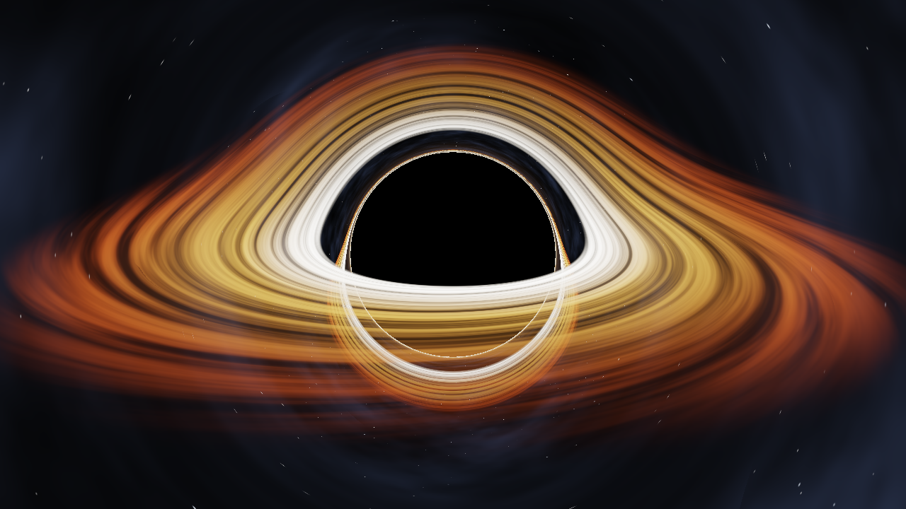
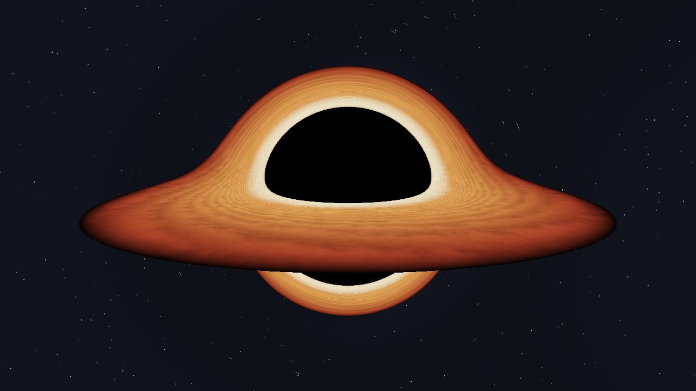

# ⚔️ Duelo: Agujero negro

- **Reto ID:** `shader_blackhole`
- **Categoría:** `shader`
- **Fecha:** `20260924-022758`
- **Ganador:** 🏆 **or:deepseek/deepseek-v4.1-flash**

---

### 📸 Capturas del Resultado:

| **A · or:deepseek/deepseek-v4.1-flash** | **B · or:openai/gpt-6-luna-pro** |
| :---: | :---: |
| <a href="a-or_deepseek_deepseek-v4.1-flash/shot_end.png"></a> | <a href="b-or_openai_gpt-6-luna-pro/shot_end.png"></a> |
| ⭐ **Nota:** 100/100 · ⏱️ 546.123s | ⭐ **Nota:** 100/100 · ⏱️ 141.069s |

---

### 🌐 Probar en vivo (en el navegador):
- **A · or:deepseek/deepseek-v4.1-flash:** [🎮 Probar demo interactiva en vivo](https://pub-68274156337740f09cc8dc0055b40362.r2.dev/matches/20260924-022758_shader_blackhole/a/index.html)
- **B · or:openai/gpt-6-luna-pro:** [🎮 Probar demo interactiva en vivo](https://pub-68274156337740f09cc8dc0055b40362.r2.dev/matches/20260924-022758_shader_blackhole/b/index.html)

---

### 📝 Prompt suministrado a ambos modelos:
> Create a full-window WebGL2 animation of a black hole, written as a single fragment shader rendered on a full-screen quad (raw WebGL2, no libraries). Requirements: a glowing, turbulent accretion disk with hot orange-white inner edge and cooler red outer regions; visible gravitational lensing (the far side of the disk bends over and under the event horizon, like the Interstellar render); a pitch-black event horizon with a thin photon ring; a starfield background that is also distorted by the lensing; the disk rotates and the camera slowly orbits and tilts over time. Use the requestAnimationFrame timestamp for time. The canvas must always fill the window and handle resizing. Starts automatically, no interaction needed.

The animation should show everything important within the first 30 seconds (that is the window we record); it may loop or continue after that.

Requirements: deliver everything in ONE self-contained HTML file (inline CSS and JavaScript; no external resources, CDNs, fonts or images). Reply with the complete file in a single ```html code block.

---

### 📊 Resultados y Métricas:

| Modelo | Nota Juez | Tiempo | Tokens | Coste | Archivos |
| :--- | :---: | :---: | :---: | :---: | :---: |
| **A · or:deepseek/deepseek-v4.1-flash** | 100 / 100 | 546.123 s | 45196 | 0.0190 $ | [Ver código](a-or_deepseek_deepseek-v4.1-flash/) |
| **B · or:openai/gpt-6-luna-pro** | 100 / 100 | 141.069 s | 19446 | 0.0116 $ | [Ver código](b-or_openai_gpt-6-luna-pro/) |

---

### 🎮 Cómo probarlo en local:
Puedes abrir directamente en tu navegador cualquiera de los archivos `index.html` dentro de cada carpeta de contendiente.

*Generado automáticamente por el pipeline de [VERSUS](https://github.com/grawwww-ai/versus-lab).*
