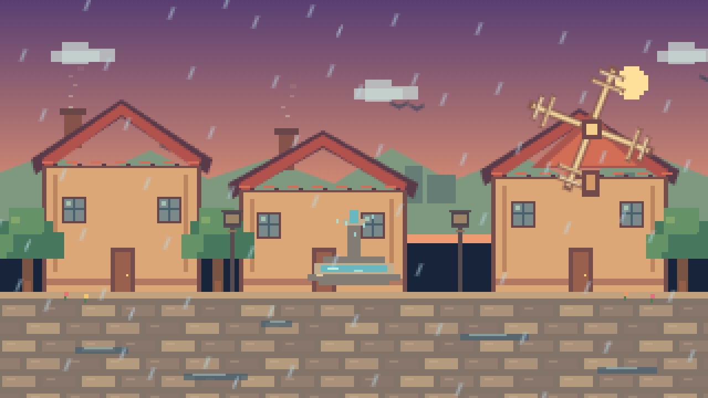

# ⚔️ Duelo: Pueblo pixel con día y noche

- **Reto ID:** `pixel_town`
- **Categoría:** `art`
- **Fecha:** `20260924-102121`
- **Ganador:** 🏆 **or:deepseek/deepseek-v4.1-flash**

---

### 📸 Capturas del Resultado:

| **A · or:deepseek/deepseek-v4.1-flash** | **B · or:openai/gpt-6-luna-pro** |
| :---: | :---: |
| <a href="a-or_deepseek_deepseek-v4.1-flash/shot_end.png"></a> | <a href="b-or_openai_gpt-6-luna-pro/shot_end.png"></a> |
| ⭐ **Nota:** 89/100 · ⏱️ 149.906s | ⭐ **Nota:** 91/100 · ⏱️ 131.395s |

---

### 🌐 Probar en vivo (en el navegador):
- **A · or:deepseek/deepseek-v4.1-flash:** [🎮 Probar demo interactiva en vivo](https://pub-68274156337740f09cc8dc0055b40362.r2.dev/matches/20260924-102121_pixel_town/a/index.html)
- **B · or:openai/gpt-6-luna-pro:** [🎮 Probar demo interactiva en vivo](https://pub-68274156337740f09cc8dc0055b40362.r2.dev/matches/20260924-102121_pixel_town/b/index.html)

---

### 📝 Prompt suministrado a ambos modelos:
> Draw a cosy 16-bit pixel art town on a canvas, animated and self-running: houses with tiled roofs and windows, a cobbled street, trees, a fountain and a mill whose blades turn. A full day cycle runs in about 20 seconds: dawn, day, sunset and night, changing the sky gradient and the light on the buildings; at night the windows and street lamps light up one by one and stars appear. Add small animated details: smoke from chimneys, water moving in the fountain, birds crossing, and rain with puddles for part of the cycle. Everything drawn procedurally in code with crisp pixels, no external images. It animates from the first frame.

The animation should show everything important within the first 30 seconds (that is the window we record); it may loop or continue after that.

Requirements: deliver everything in ONE self-contained HTML file (inline CSS and JavaScript; no external resources, CDNs, fonts or images). Reply with the complete file in a single ```html code block.

---

### 📊 Resultados y Métricas:

| Modelo | Nota Juez | Tiempo | Tokens | Coste | Archivos |
| :--- | :---: | :---: | :---: | :---: | :---: |
| **A · or:deepseek/deepseek-v4.1-flash** | 89 / 100 | 149.906 s | 41872 | 0.0503 $ | [Ver código](a-or_deepseek_deepseek-v4.1-flash/) · [🎮 Jugar demo](https://pub-68274156337740f09cc8dc0055b40362.r2.dev/matches/20260924-102121_pixel_town/a/index.html) |
| **B · or:openai/gpt-6-luna-pro** | 91 / 100 | 131.395 s | 18756 | 0.0113 $ | [Ver código](b-or_openai_gpt-6-luna-pro/) · [🎮 Jugar demo](https://pub-68274156337740f09cc8dc0055b40362.r2.dev/matches/20260924-102121_pixel_town/b/index.html) |

---

### 🎮 Cómo probarlo en local:
Puedes abrir directamente en tu navegador cualquiera de los archivos `index.html` dentro de cada carpeta de contendiente.

*Generado automáticamente por el pipeline de [VERSUS](https://github.com/grawwww-ai/versus-lab).*
