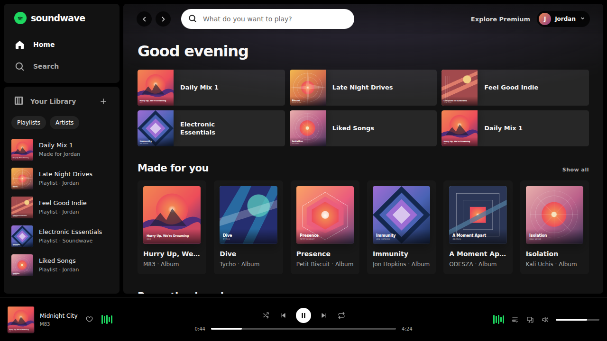

# ⚔️ Duelo: Clon de Spotify

- **Reto ID:** `spotify_clone`
- **Categoría:** `web`
- **Fecha:** `20260924-103532`
- **Ganador:** 🏆 **or:deepseek/deepseek-v4.1-flash**

---

### 📸 Capturas del Resultado:

| **A · or:deepseek/deepseek-v4.1-flash** | **B · or:openai/gpt-6-luna-pro** |
| :---: | :---: |
| <a href="a-or_deepseek_deepseek-v4.1-flash/shot_end.png"></a> | <a href="b-or_openai_gpt-6-luna-pro/shot_end.png"></a> |
| ⭐ **Nota:** 100/100 · ⏱️ 118.165s | ⭐ **Nota:** 100/100 · ⏱️ 178.788s |

---

### 🌐 Probar en vivo (en el navegador):
- **A · or:deepseek/deepseek-v4.1-flash:** [🎮 Probar demo interactiva en vivo](https://pub-68274156337740f09cc8dc0055b40362.r2.dev/matches/20260924-103532_spotify_clone/a/index.html)
- **B · or:openai/gpt-6-luna-pro:** [🎮 Probar demo interactiva en vivo](https://pub-68274156337740f09cc8dc0055b40362.r2.dev/matches/20260924-103532_spotify_clone/b/index.html)

---

### 📝 Prompt suministrado a ambos modelos:
> Build a convincing clone of the Spotify web player in one HTML file: dark sidebar with library and playlists, a main area with rows of albums and covers, a search bar, a now-playing bar at the bottom with cover, title, progress bar, controls and volume, and an animated audio visualiser. Album covers are generated procedurally in code (gradients, shapes, typography), each one different, no external images. A track plays by itself: the progress bar advances, the visualiser moves, the cover animates, and the view changes between home, a playlist and the artist page. Careful typography, hover states and spacing like the real thing.

Requirements: deliver everything in ONE self-contained HTML file (inline CSS and JavaScript; no external resources, CDNs, fonts or images). Reply with the complete file in a single ```html code block.

---

### 📊 Resultados y Métricas:

| Modelo | Nota Juez | Tiempo | Tokens | Coste | Archivos |
| :--- | :---: | :---: | :---: | :---: | :---: |
| **A · or:deepseek/deepseek-v4.1-flash** | 100 / 100 | 118.165 s | 44816 | 0.0538 $ | [Ver código](a-or_deepseek_deepseek-v4.1-flash/) |
| **B · or:openai/gpt-6-luna-pro** | 100 / 100 | 178.788 s | 40584 | 0.0243 $ | [Ver código](b-or_openai_gpt-6-luna-pro/) |

---

### 🎮 Cómo probarlo en local:
Puedes abrir directamente en tu navegador cualquiera de los archivos `index.html` dentro de cada carpeta de contendiente.

*Generado automáticamente por el pipeline de [VERSUS](https://github.com/grawwww-ai/versus-lab).*
