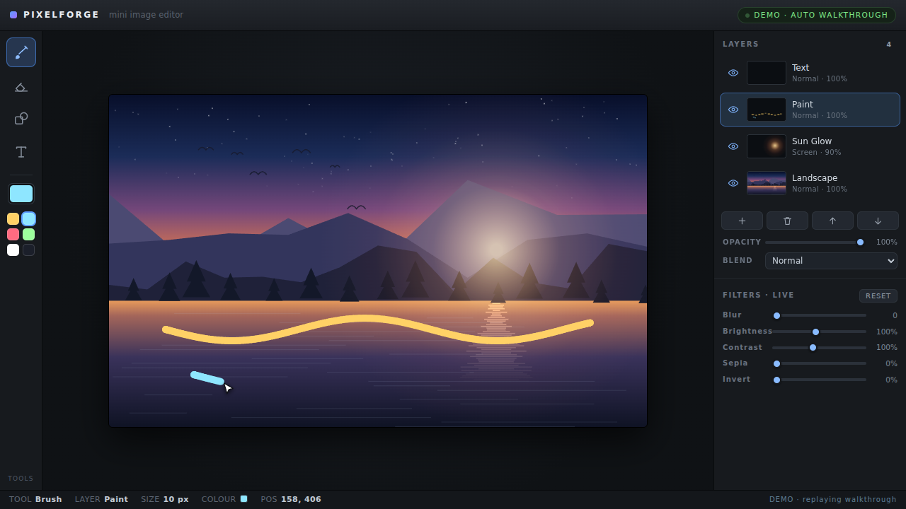
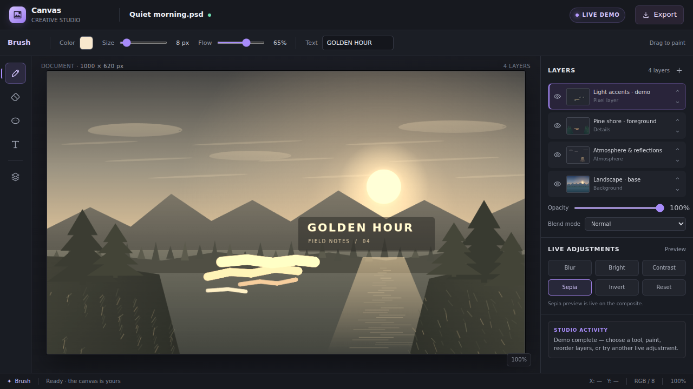

# ⚔️ Duelo: Mini Photoshop

- **Reto ID:** `mini_photoshop`
- **Categoría:** `art`
- **Fecha:** `20260924-104409`
- **Ganador:** 🏆 **or:deepseek/deepseek-v4.1-flash**

---

### 📸 Capturas del Resultado:

| **A · or:deepseek/deepseek-v4.1-flash** | **B · or:openai/gpt-6-luna-pro** |
| :---: | :---: |
| <a href="a-or_deepseek_deepseek-v4.1-flash/shot_end.png"></a> | <a href="b-or_openai_gpt-6-luna-pro/shot_end.png"></a> |
| ⭐ **Nota:** 100/100 · ⏱️ 134.113s | ⭐ **Nota:** 100/100 · ⏱️ 232.073s |

---

### 🌐 Probar en vivo (en el navegador):
- **A · or:deepseek/deepseek-v4.1-flash:** [🎮 Probar demo interactiva en vivo](https://pub-68274156337740f09cc8dc0055b40362.r2.dev/matches/20260924-104409_mini_photoshop/a/index.html)
- **B · or:openai/gpt-6-luna-pro:** [🎮 Probar demo interactiva en vivo](https://pub-68274156337740f09cc8dc0055b40362.r2.dev/matches/20260924-104409_mini_photoshop/b/index.html)

---

### 📝 Prompt suministrado a ambos modelos:
> Build a mini image editor in one HTML file, like a small Photoshop: a canvas with a sample image drawn procedurally in code (a landscape), a layers panel with at least three layers that can be hidden or reordered, a toolbar with brush, eraser, shapes and text, a colour picker, opacity and blend modes, and filters (blur, brightness, contrast, sepia, invert) applied live. It must run a DEMO by itself from the first second: the tool cursor moves alone painting strokes, adds a new layer, writes a text label, applies a filter and toggles a layer, so the whole editor is shown without anyone touching it. Professional dark interface, readable icons drawn in code, and a status bar with the active tool.

The animation should show everything important within the first 30 seconds (that is the window we record); it may loop or continue after that.

Requirements: deliver everything in ONE self-contained HTML file (inline CSS and JavaScript; no external resources, CDNs, fonts or images). Reply with the complete file in a single ```html code block.

---

### 📊 Resultados y Métricas:

| Modelo | Nota Juez | Tiempo | Tokens | Coste | Archivos |
| :--- | :---: | :---: | :---: | :---: | :---: |
| **A · or:deepseek/deepseek-v4.1-flash** | 100 / 100 | 134.113 s | 37161 | 0.0447 $ | [Ver código](a-or_deepseek_deepseek-v4.1-flash/) |
| **B · or:openai/gpt-6-luna-pro** | 100 / 100 | 232.073 s | 34765 | 0.0207 $ | [Ver código](b-or_openai_gpt-6-luna-pro/) |

---

### 🎮 Cómo probarlo en local:
Puedes abrir directamente en tu navegador cualquiera de los archivos `index.html` dentro de cada carpeta de contendiente.

*Generado automáticamente por el pipeline de [VERSUS](https://github.com/grawwww-ai/versus-lab).*
