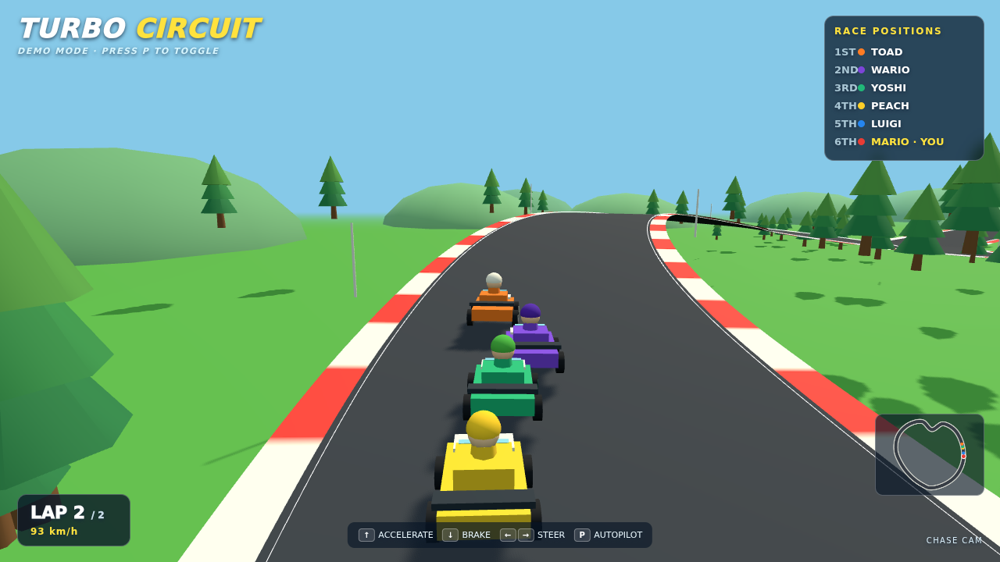

# ⚔️ Duelo: Carrera de karts

- **Reto ID:** `kart_race`
- **Categoría:** `game`
- **Fecha:** `20260924-134226`
- **Ganador:** 🏆 **or:deepseek/deepseek-v4.1-flash**

---

### 📸 Capturas del Resultado:

| **A · or:deepseek/deepseek-v4.1-flash** | **B · or:openai/gpt-6-luna-pro** |
| :---: | :---: |
| <a href="a-or_deepseek_deepseek-v4.1-flash/shot_end.png"></a> | <a href="b-or_openai_gpt-6-luna-pro/shot_end.png"></a> |
| ⭐ **Nota:** 84/100 · ⏱️ 851.397s | ⭐ **Nota:** 80/100 · ⏱️ 153.871s |

---

### 🌐 Probar en vivo (en el navegador):
- **A · or:deepseek/deepseek-v4.1-flash:** [🎮 Probar demo interactiva en vivo](https://pub-68274156337740f09cc8dc0055b40362.r2.dev/matches/20260924-134226_kart_race/a/index.html)
- **B · or:openai/gpt-6-luna-pro:** [🎮 Probar demo interactiva en vivo](https://pub-68274156337740f09cc8dc0055b40362.r2.dev/matches/20260924-134226_kart_race/b/index.html)

---

### 📝 Prompt suministrado a ambos modelos:
> Using three.js, build a Mario Kart style race that runs itself: a closed circuit with curves, hills, kerbs and decorated scenery, and six karts driven by AI that follow the racing line, take the corners, drift and overtake each other. Karts have simple drivers, wheels that turn and dust or skid particles. Show a live position list (1st to 6th), a lap counter, and a chase camera on the leading kart that cuts occasionally to a trackside camera. Include a start countdown. The player drives one of the karts with the arrow keys; the race starts with the countdown and lasts at least two laps.

It must be genuinely PLAYABLE by a human: the player is controlled with the keyboard (and mouse if it helps), the controls are shown on screen at the start, and the game reacts immediately to input. On top of that, include an autoplay demo mode toggled with the P key, in which the game plays itself competently (an AI controls the player) so a viewer can watch a good run; the demo must stop as soon as the player presses a control key, giving control back.

three.js (r186) is available as an ES module: use `import * as THREE from 'three'` and addons from 'three/addons/...' (e.g. 'three/addons/controls/OrbitControls.js') inside <script type="module">. An import map is provided for you: do not add your own import map or any CDN URL.

The animation should show everything important within the first 30 seconds (that is the window we record); it may loop or continue after that.

Requirements: deliver everything in ONE self-contained HTML file (inline CSS and JavaScript; no external resources, CDNs, fonts or images). Reply with the complete file in a single ```html code block.

---

### 📊 Resultados y Métricas:

| Modelo | Nota Juez | Tiempo | Tokens | Coste | Archivos |
| :--- | :---: | :---: | :---: | :---: | :---: |
| **A · or:deepseek/deepseek-v4.1-flash** | 84 / 100 | 851.397 s | 58981 | 0.0355 $ | [Ver código](a-or_deepseek_deepseek-v4.1-flash/) · [🎮 Jugar demo](https://pub-68274156337740f09cc8dc0055b40362.r2.dev/matches/20260924-134226_kart_race/a/index.html) |
| **B · or:openai/gpt-6-luna-pro** | 80 / 100 | 153.871 s | 26281 | 0.0157 $ | [Ver código](b-or_openai_gpt-6-luna-pro/) · [🎮 Jugar demo](https://pub-68274156337740f09cc8dc0055b40362.r2.dev/matches/20260924-134226_kart_race/b/index.html) |

---

### 🎮 Cómo probarlo en local:
Puedes abrir directamente en tu navegador cualquiera de los archivos `index.html` dentro de cada carpeta de contendiente.

*Generado automáticamente por el pipeline de [VERSUS](https://github.com/grawwww-ai/versus-lab).*
