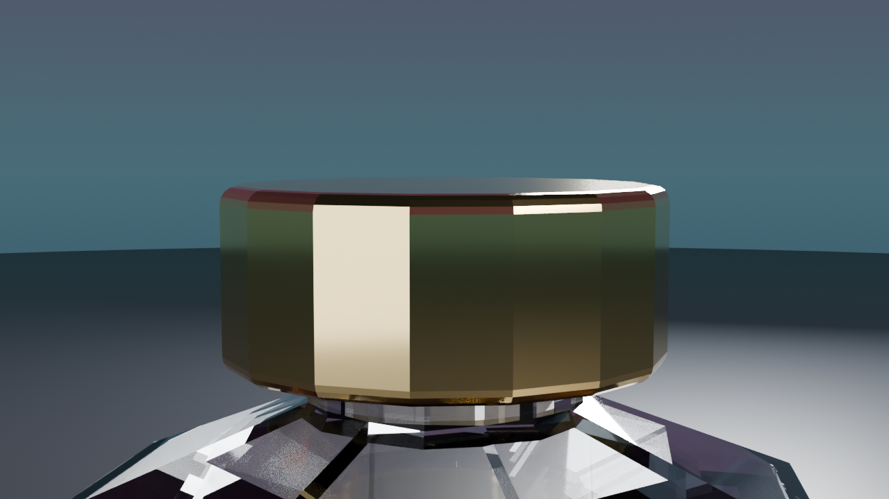

# ⚔️ Duelo: Anuncio de perfume

- **Reto ID:** `bl_perfume_estudio`
- **Categoría:** `blender`
- **Fecha:** `20260925-113411`
- **Ganador:** 🏆 **or:deepseek/deepseek-v4.1-flash**

---

### 📸 Capturas del Resultado:

| **A · or:deepseek/deepseek-v4.1-flash** | **B · or:openai/gpt-6-luna-pro** |
| :---: | :---: |
| <a href="a-or_deepseek_deepseek-v4.1-flash/shot_end.png"></a> | <a href="b-or_openai_gpt-6-luna-pro/shot_end.png"></a> |
| ⭐ **Nota:** 91/100 · ⏱️ 102.583s | ⭐ **Nota:** 78/100 · ⏱️ 89.819s |

---

### 📝 Prompt suministrado a ambos modelos:
> Create a luxury perfume commercial shot in a photo studio. A faceted crystal-glass perfume bottle filled with amber liquid, with a polished gold cap, stands on a slowly rotating round black marble pedestal. Studio lighting like a real product shoot: a large soft key light, a rim light that outlines the glass edges and a subtle coloured backdrop gradient. The glass must refract and the liquid must glow where the light passes through it; the gold must reflect the studio. Over the whole animation the camera slowly orbits and gently pushes in towards the bottle, ending on a close-up of the cap.

Requirements: write ONE Python script for Blender 4.5 LTS (bpy) that builds the whole scene from scratch when run in background mode (blender -b --factory-startup --python script.py): delete the default objects and create every object, material, light, the world and a camera (set it as scene.camera), animated over frames 1 to 720 at 24 fps (30 seconds): the motion must fill the whole duration, not finish early and freeze. Do NOT render, do not set the render engine, resolution, samples or output path, and do not save any file: we render your scene ourselves with Cycles on a GPU (1280x720, 128 samples, denoised, at most 3 seconds per frame), with exactly the same settings for both contestants. Use only bpy, mathutils, math and the Python standard library: no add-ons, no external files, images, textures or downloads (build materials procedurally with shader nodes). Reply with the complete script in a single ```python code block.

---

### 📊 Resultados y Métricas:

| Modelo | Nota Juez | Tiempo | Tokens | Coste | Archivos |
| :--- | :---: | :---: | :---: | :---: | :---: |
| **A · or:deepseek/deepseek-v4.1-flash** | 91 / 100 | 102.583 s | 34134 | 0.0411 $ | [Ver código](a-or_deepseek_deepseek-v4.1-flash/) · [🎬 Ver render](https://pub-68274156337740f09cc8dc0055b40362.r2.dev/matches/20260925-113411_bl_perfume_estudio/a/capture.mp4) |
| **B · or:openai/gpt-6-luna-pro** | 78 / 100 | 89.819 s | 9874 | 0.0050 $ | [Ver código](b-or_openai_gpt-6-luna-pro/) · [🎬 Ver render](https://pub-68274156337740f09cc8dc0055b40362.r2.dev/matches/20260925-113411_bl_perfume_estudio/b/capture.mp4) |

---

### 🎮 Cómo probarlo en local:
Puedes abrir directamente en tu navegador cualquiera de los archivos `index.html` dentro de cada carpeta de contendiente.

*Generado automáticamente por el pipeline de [VERSUS](https://github.com/grawwww-ai/versus-lab).*
